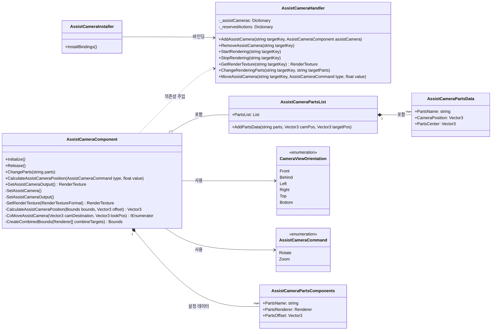

+++
title = "Assist Camera"
description = "보조렌더링 도구"
icon = "videocam"
date = "2023-05-22T00:27:57+01:00"
lastmod = "2023-05-22T00:27:57+01:00"
draft = false
toc = true
weight = 308
+++

<br>

## 기능 개요

- **AssistCamera**는 아바타 커스터마이징 및 각종 화면에서 사용자 아바타나 오브젝트를 별도의 `Transform`, `Vector3` 지정 없이 `Renderer.bounds` 수치를 기반으로 카메라 오브젝트를 적합한 위치로 이동시켜주는 보조 렌더링 도구입니다.
- **제작기간**: 2주

### 개발 배경 및 요구사항
- 아바타 커스터마이징 시스템에서 다양한 크기의 오브젝트들을 렌더링 할 때, 오브젝트에 따라 크기가 달라 일일이 카메라의 `offset` 지정해줘야 하는 불편함이 있어 해당 유틸리티 개발.
- 사용자가 특정 아웃핏을 착용하거나 프리뷰 할 때 해당 부위를 보여 줄 수 있는 최적회된 렌더링 위치로 자동으로 카메라가 이동 및 회전 제공.
- `RenderTexture`를 통해 해당 카메라의 렌더링을 제공.
- 카메라 확대 및 회전 기능을 염두에 두고 제작.
- 모듈화로 다른 프로젝트에서도 사용 할 수 있게 의존성을 최소화한다.

### 주요 기능
- **자동 위치 계산**: `Renderer.bounds'를 병합하여 크기와 형태를 분석하여 최적의 카메라 위치 계산
- **부드러운 이동**: 코루틴 기반 자연스러운 카메라 전환 및 이동
- **줌 및 회전 조작**: 사용자 입력에 따른 실시간 카메라 컨트롤
- **다중 인스턴스 관리**: 다중 카메라 인스턴스를 효율적으로 관리
- **파츠별 포커싱**: 특정 신체 부위나 의상 파츠에 대한 자동 카메라 포커싱

## 2. 사용된 기술 요소

### 핵심 기술 스택
- **Bounds 계산 알고리즘**으로 객체 중심점 및 크기 자동 분석
- **RenderTexture**를 통한 고성능 오프스크린 렌더링
- **코루틴 패턴**을 활용한 부드러운 카메라 이동 애니메이션

### 설계 활용 패턴
- **Clean Architecture 구현**: 계층 분리(Presentation → Domain → Data), 의존성 역전(인터페이스 기반 설계), 단일 책임 원칙
- **전략패턴**: `CameraViewOrientation` 열거형을 통한 다양한 카메라 시점 전략
- **싱글톤 패턴**: `AssistCameraHandler`를 통한 중앙집중식 카메라 관리
- **의존성 주입 패턴**: Zenject를 활용한 모듈화 아키텍처
- **예약 액션 패턴**: 초기화 순서 문제 해결을 위한 예약 액션 시스템

## 3. 주요 클래스별 역할 및 관계

### 예시 워크플로우
```csharp
// 1. 씬에 AssistCameraComponent 배치 (targetKey: "Avatar")
// 2. Handler를 통한 제어
handler.StartRendering("Avatar");                    // 렌더링 시작
handler.ChangeRenderingParts("Avatar", "Head");      // 머리 파츠 포커스
handler.MoveAssistCamera("Avatar", Rotate, 45f);     // 45도 회전
var texture = handler.GetRenderTexture("Avatar");    // UI에 표시
handler.StopRendering("Avatar");                      // 완료 시 정리
```

### 이벤트 흐름도
```
User Input → AssistCameraHandler → AssistCameraComponent
    ↓
Initialize() → SetAssistCamera() → RenderTexture 생성
    ↓
ChangeParts() → CalculateAssistCameraPosition() → 코루틴 이동
    ↓
GetRenderTexture() → UI 표시 → 사용자 확인
```

### AssistCameraComponent (핵심 카메라 기능 클래스)
- 개별 카메라의 모든 기능을 담당하는 핵심 클래스
- RenderTexture를 통한 고성능 오프스크린 렌더링
- Bounds 계산 알고리즘으로 객체 중심점 및 크기 자동 분석
- 코루틴 기반 부드러운 카메라 이동 애니메이션
- 플랫폼별 안티앨리어싱 설정으로 성능 최적화

#### 주요 Property 및 설명
```csharp
public GameObject targetRoot;           // 렌더링할 대상 객체의 루트
public string targetKey;                // 카메라 인스턴스 식별 키
public CameraViewOrientation viewOrientation; // 카메라 시점 방향
public Vector3 defaultCameraOffset;      // 기본 카메라 오프셋
public Vector2 renderTextureSize;       // 렌더 텍스처 크기
public List<AssistCameraPartsComponents> renderParts; // 포커싱할 파츠 목록
public float cameraSpeed;               // 카메라 이동 속도
public float nearestDistance;           // 최소 줌 거리
public float longestDistance;           // 최대 줌 거리
public RawImage outputRawImage;         // 출력할 UI RawImage
```

#### 주요 Public 메서드 및 역할
```csharp
public void Initialize()                // 카메라 초기화 및 설정
public void Release()                   // 카메라 리소스 해제
public void ChangeParts(string parts)   // 특정 파츠로 카메라 이동
public void CalculateAssistCameraPosition(AssistCameraCommand type, float value) // 카메라 위치 계산 및 이동
public RenderTexture GetAssistCameraOutput() // 렌더 텍스처 반환
```

#### 핵심 코드 스니펫
```csharp
private Vector3 CalculateAssistCameraPosition(Bounds bounds, Vector3 offset)
{
    float distance = bounds.size.magnitude / (2f * Mathf.Tan(Mathf.Deg2Rad * _assistantCamera.fieldOfView / 2f));

    Vector3 targetPos = bounds.center;

    switch (viewOrientation)
    {
        case CameraViewOrientation.Front:
            targetPos = new Vector3(bounds.center.x, bounds.center.y, bounds.center.z + distance);
            break;
        case CameraViewOrientation.Behind:
            targetPos = new Vector3(bounds.center.x, bounds.center.y, bounds.center.z - distance);
            break;
        // ... 기타 방향들
    }

    targetPos += offset;
    return targetPos;
}
```

### AssistCameraHandler (중앙관리 시스템)
- 싱글톤 패턴으로 구현된 중앙집중식 카메라 관리 시스템
- 다중 카메라 인스턴스를 효율적으로 관리
- 예약 액션 패턴을 통한 초기화 순서 문제 해결

#### 주요 메서드 및 역할
```csharp
public void AddAssistCamera(string targetKey, AssistCameraComponent assistCamera)    // 카메라 등록
public void RemoveAssistCamera(string targetKey)                                     // 카메라 제거
public void StartRendering(string targetKey)                                         // 렌더링 시작
public void StopRendering(string targetKey)                                          // 렌더링 중지
public RenderTexture GetRenderTexture(string targetKey)                              // 렌더 텍스처 반환
public void ChangeRenderingParts(string targetKey, string targetParts)               // 파츠 변경
public void MoveAssistCamera(string targetKey, AssistCameraCommand type, float value) // 카메라 이동
```

### AssistCameraPartsList (파츠 데이터 관리)
- 카메라 포커싱 파츠 정보를 관리하는 데이터 클래스
- 파츠별 카메라 위치와 타겟 위치를 저장

### AssistCameraPartsData (파츠 데이터 구조)
- 개별 파츠의 카메라 위치와 중심점 정보를 담는 데이터 구조체

## AssistCameraInstaller (의존성 주입 설정)
- Zenject를 활용한 의존성 주입 설정 클래스
- AssistCameraHandler를 싱글톤으로 바인딩

### 전체 클래스 다이어그램


## 4. 주요 특징 및 최적화

### 기능의 특징
- **지능적 위치 계산**: 객체의 바운딩 박스를 분석하여 최적의 카메라 거리와 각도를 자동 계산
- **부드러운 애니메이션**: 코루틴을 활용한 자연스러운 카메라 이동으로 사용자 경험 향상
- **다양한 시점 지원**: Front, Behind, Left, Right, Top, Bottom 등 6방향 카메라 시점 제공
- **파츠별 포커싱**: 사용자가 선택한 특정 부위로 자동 카메라 이동 및 확대
- **실시간 조작**: 회전 및 줌 기능을 통한 실시간 카메라 컨트롤

### 플랫폼별 최적화
- **iOS**: 안티앨리어싱 1x 설정으로 배터리 및 성능 최적화
- **기타 플랫폼**: 안티앨리어싱 4x 설정으로 고품질 이미지 제공

### 메모리 관리
- RenderTexture의 적절한 생성 및 해제 타이밍 관리
- 사용하지 않는 카메라 리소스의 자동 정리
- 텍스처 크기 조절을 통한 메모리 사용량 최적화

### 실시간 성능 모니터링
- 디버깅 로그 시스템을 통한 실시간 성능 추적
- 카메라 이동 상태 플래그를 활용한 중복 호출 방지
- 예외 상황에 대한 안전한 에러 처리

## 5. 활용 사례

### 아바타 피팅룸 시나리오
1. **기본 상태**: 아바타 전체를 보여주는 기본 카메라 시점
2. **얼굴 부위 확대**: 얼굴 부분 클릭 시 해당 부위로 카메라 자동 이동
3. **의상 상세 보기**: 특정 의상 부위 클릭 시 해당 부분 확대
4. **360도 회전**: 사용자 드래그로 아바타 주변 회전
5. **줌 기능**: 핀치 제스처로 아바타 크기 조절

### 주요 사용처
- 아바타 커스터마이징 시스템의 디테일 뷰어
- 의상 피팅룸의 확대 보기 기능
- 3D 객체의 상세 확인이 필요한 모든 UI 시스템
- VR/AR 환경에서의 객체 포커싱 시스템


