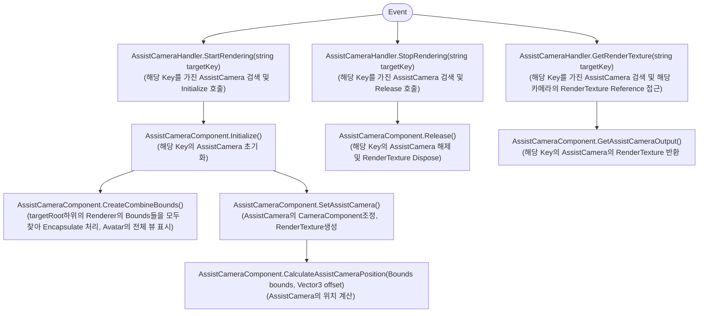
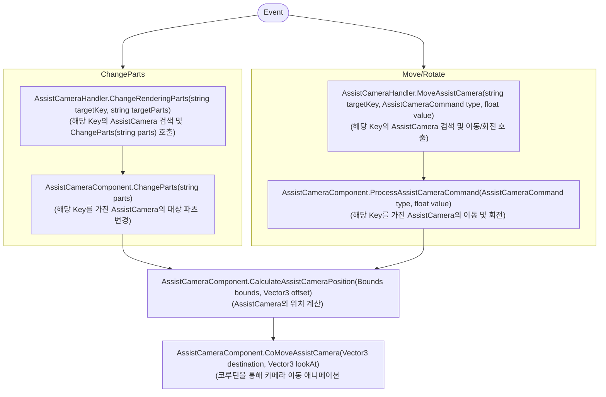
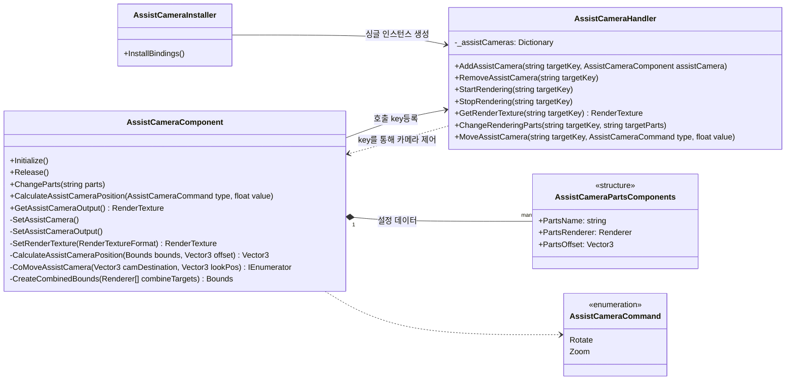

+++
title = "Assist Camera(서브 카메라 유틸리티)"
description = "보조렌더링 도구"
icon = "videocam"
date = "2023-05-22T00:27:57+01:00"
lastmod = "2023-05-22T00:27:57+01:00"
draft = false
toc = true
weight = 308
+++

## 1. 기능 개요

- **AssistCamera**는 아바타 커스터마이징 시스템에서 다양한 크기의 오브젝트에 대해 수동 오프셋 조정 없이 카메라가 동적으로 최적의 뷰를 잡아주는 자동 피팅 로직 및 외부로 렌더링 결과를 전송하기 위한 범용 서브 카메라 관리 모듈입니다.
- **제작기간**: 2023.06(2주)

### 개발 배경 및 요구사항
- `Unity`에서 특정 오브젝트의 렌더링 결과를 다른 `Context` (Web/Native AOS, Native IOS)로 보내기 위한 기능 개발을 목적으로 개발 시작. 
- 아바타 커스터마이징 시스템에서 다양한 크기의 아웃핏 오브젝트들을 아바타에게 입힐 때 때, 오브젝트에 따라 크기가 달라 일일이 카메라의 `offset` 지정해줘야 하는 불편함이 있어 `Renderer.bounds`를 기반하여 자동 카메라 이동 및 회전 기능 추가.
- 모듈화를 통해 다른 프로젝트 및 다른 씬에서도 개별적으로 사용 할 수 있게 의존성 최소화.

### 주요 기능
- **카메라 자동 위치 계산**: `Renderer.bounds` 를 병합하여 크기와 형태를 분석하고, `FOV`를 고려한 삼각함수 기반 거리 역산을 통해 최적의 카메라 위치 계산.
- **다중 인스턴스 관리**: `targetKey` 를 통해 ㄷ다중 카메라 인스턴스를 식별하고, 중앙 관리 시스템 `AssistCameraHandler`를 통해 효율적으로 제어.
- **줌 및 회전 조작**: 사용자 입력에 따른 런타임 카메라 컨트롤을 제공하며 코루틴을 활용하여 부드러운 이동 애니메이션 구현.
- **파츠별 포커싱**: `Renderer.bounds` 를 참조할 파츠의 키를 지정하여 해당 부위로 카메라를 자동 이동 및 확대.
- **RenderTexture 아웃풋 관리**: 출력할 렌더 텍스쳐를 생성/관리하고 플랫폼별 셋팅도 추가로 관리.  

## 2. 사용된 기술 요소

### 핵심 기술 요소 및 API 활용
- **C#**: 전체 핵심 로직 및 유니티 컴포넌트 구현.
- **RenderTexture**: 아바타/오브젝트의 오프스크린 렌더링을 구현하고, 결과를 다른 플랫폼(Native/Web)으로 전송 할 수 있도록 관리.
- **Bounds 병합 및 거리 계산**: `Renderer.bounds` 를 Encapsulate하여 복합 오브젝트의 전체 크기를 파악하고, `FOV` 와 삼각함수를 이용해 객체를 완전히 담는 최적 거리를 역산하는 위치 계산 로직 구현.
- [**Zenject**](https://github.com/modesttree/Zenject): `AssistCameraHander` 를 싱글톤 인스턴스로 바인딩하여 다중 카메라 인스턴스를 중앙 집중식으로 관리하고, 낮은 결합도 및 재사용성 확보.
- **Coroutine**: 카메라 이동/회전 시 프레임 단위로 이동량을 분산시켜 부드러운 애니메이션 트랜지션 효과 구현.

### 설계 활용 패턴
- **전략패턴**: `CameraViewOrientation` 을 통해 Front/Behind/Top/... 등 6가지 카메라 시점 전략을 정의하고 동적으로 시점을 변경하는 로직에 적용.
- **명령 대기열**: `AssistCameraHandler`가 초기화 되기전에 `AssistCameraComponent`에서 발생한 요청을 저장 및 실행하는 초기화 순서 문제 해결 로직 구현.

## 3. 주요 클래스별 역할 및 관계

### 예시 워크플로우
```csharp
// 1. 씬에 AssistCameraComponent 배치 (targetKey: "Avatar")
// 2. Handler를 통한 제어
handler.StartRendering("Avatar");                    // 렌더링 시작
handler.ChangeRenderingParts("Avatar", "Head");      // 머리 파츠 포커스
handler.MoveAssistCamera("Avatar", Rotate, 45f);     // 45도 회전
var texture = handler.GetRenderTexture("Avatar");    // UI에 표시
handler.StopRendering("Avatar");                      // 완료 시 정리
```

<br>

### 이벤트 흐름도(초기화, 해제, RenderTexture호출)



<br><br>

### 이벤트 흐름도(파츠변경, 이동/회전)


### 주요 클래스

#### AssistCameraComponent (핵심 카메라 기능 클래스)
- 서브 카메라 인스턴스 자체의 기능(위치계산, 렌더링 설정, 이동 애니메이션)을 담당하는 `MonoBehaviour` 컴포넌트
- 여러대의 서브카메라 인스턴스가 필요한 경우 `targetKey`를 통해 인스턴스 구분.
- `FOV` 와 객체의 `bounds.size.magnitude` 를 이용해 카메라 거리를 역산하여 객체를 프러스텀에 포함시키는 자동 위치 계산 로직 구현.
- `RenderTexture` 의 생성 및 해제, 레퍼런스 관리.
- `ChangeParts(string parts)` 호출을 통해 렌더링 대상 변경.
- `CalculateAssistCameraPosition(AssistCameraCommand command, float value)` 호출을 통해 카메라 회전 및 거리 조절. 
- 코루틴을 통한 카메라 이동 애니메이션.
- 플랫폼별 `RenderTexture` 해상도 및 안티앨리어싱 설정.

##### 주요 Property 및 설명
```csharp
[SerializeField] private GameObject targetRoot;           // 렌더링할 대상 객체의 루트
[SerializeField] private string targetKey;                // 카메라 인스턴스 식별 키
[SerializeField] private CameraViewOrientation viewOrientation; // 카메라 시점 방향
[SerializeField] private Vector3 defaultCameraOffset;      // 기본 카메라 오프셋
[SerializeField] private Vector2 renderTextureSize;       // 렌더 텍스처 크기
[SerializeField] private List<AssistCameraPartsComponents> renderParts; // 포커싱할 파츠 목록
[SerializeField] private float cameraSpeed;               // 카메라 이동 속도
[SerializeField] private float nearestDistance;           // 최소 줌 거리
[SerializeField] private float longestDistance;           // 최대 줌 거리
[SerializeField] private RawImage outputRawImage;         // 출력할 UI RawImage
```

#### 주요 Public 메서드 및 역할
```csharp
public void Initialize()                // 카메라 초기화 및 렌더링 시작
public void Release()                   // 카메라 리소스 및 RenderTexture 해제
public void ChangeParts(string parts)   // PartsData에 있는 파츠를 찾고 대상의 포로 카메라 이동
public RenderTexture GetAssistCameraOutput() // 렌더 텍스처 반환
public void ProcessAssistCameraCommand(AssistCameraCommand type, float value) // Command를 통해 카메라 이동.
```

#### 핵심 코드 스니펫
```csharp
private Vector3 CalculateAssistCameraPosition(Bounds bounds, Vector3 offset)
{
    // 삼각함수 계산을 통한 거리측정
    float distance = bounds.size.magnitude / (2f * Mathf.Tan(Mathf.Deg2Rad * _assistantCamera.fieldOfView / 2f));

    Vector3 targetPos = bounds.center;

    switch (viewOrientation)
    {
        case CameraViewOrientation.Front:
            targetPos = new Vector3(bounds.center.x, bounds.center.y, bounds.center.z + distance);
            break;
        case CameraViewOrientation.Behind:
            targetPos = new Vector3(bounds.center.x, bounds.center.y, bounds.center.z - distance);
            break;
        // ... 기타 방향들
    }

    targetPos += offset;
    return targetPos;
}

public void ProcessAssistCameraCommand(AssistCameraCommand type, float value)
{
    ...
    switch (type)
    {
        case AssistCameraCommand.Rotate:
            Quaternion rotation = Quaternion.AngleAxis(value, direction);
            Vector3 rotatedDirection = rotation * toTarget.normalized;
            movePosition = _curruntBoundsCenter + rotatedDirection * distance;
            break;

        case AssistCameraCommand.Zoom:
            float zoomedDistance = Mathf.Clamp(distance - value, nearestDistance, longestDistance);
            movePosition = _curruntBoundsCenter - _assistantCamera.transform.forward * zoomedDistance;
            break;
    }
    StartCoroutine(CoMoveAssistCamera(movePosition, _curruntBoundsCenter));
}
```

### AssistCameraHandler (중앙관리 시스템) 
- 싱글 인스턴스로 씬에 배치된 `AssistCameraInstaller.cs` 에서 바인딩됨.
- 다중 카메라 인스턴스를 등록 및 사용 관리.
- 다른 클래스에서 `AssistCameraComponent` 인스턴스를 참조하지 않아도 key를 통해 호출 할 수 있는 Handler.
- 예약 액션 패턴을 통한 초기화 순서 문제 해결

#### 주요 메서드 및 역할
```csharp
public void AddAssistCamera(string targetKey, AssistCameraComponent assistCamera)    // 카메라 등록
public void RemoveAssistCamera(string targetKey)                                     // 카메라 제거
public void StartRendering(string targetKey)                                         // 렌더링 시작
public void StopRendering(string targetKey)                                          // 렌더링 중지
public RenderTexture GetRenderTexture(string targetKey)                              // 렌더 텍스처 반환
public void ChangeRenderingParts(string targetKey, string targetParts)               // 파츠 변경
public void MoveAssistCamera(string targetKey, AssistCameraCommand type, float value) // 카메라 이동
```

### AssistCameraPartsList (파츠 데이터 관리)
- 카메라 포커싱 파츠 정보를 관리하는 데이터 클래스
- 파츠별 카메라 위치와 타겟 위치를 저장

### AssistCameraPartsData (파츠 데이터 구조)
- 개별 파츠의 카메라 위치와 중심점 정보를 담는 데이터 구조체

### AssistCameraInstaller (의존성 주입 설정)
- `Zenject`[](https://github.com/modesttree/Zenject) 플러그인을 활용한 의존성 주입 설정 클래스
- 씬이 로드 될 때 `AssistCameraHandler.cs` 를 싱글톤 인스턴스로 바인딩

### 전체 클래스 다이어그램


## 4. 메모리 관리 및 최적화

### 메모리 관리
- RenderTexture의 적절한 생성 및 해제 타이밍 관리
- 사용하지 않는 카메라 리소스의 자동 정리
- 텍스처 크기 조절을 통한 메모리 사용량 최적화

### 실시간 성능 모니터링
- 디버깅 로그 시스템을 통한 실시간 성능 추적
- 카메라 이동 상태 플래그를 활용한 중복 호출 방지
- 예외 상황에 대한 안전한 에러 처리

## 5. 활용 사례

### 아바타 피팅룸 시나리오
1. **기본 상태**: 아바타 전체를 보여주는 기본 카메라 시점
2. **얼굴 부위 확대**: 얼굴 부분 클릭 시 해당 부위로 카메라 자동 이동
3. **의상 상세 보기**: 특정 의상 부위 클릭 시 해당 부분 확대
4. **360도 회전**: 사용자 드래그로 아바타 주변 회전
5. **줌 기능**: 핀치 제스처로 아바타 크기 조절

### 주요 사용처
- 아바타 커스터마이징 시스템의 디테일 뷰어
- 의상 피팅룸의 확대 보기 기능
- 3D 객체의 상세 확인이 필요한 모든 UI 시스템
- VR/AR 환경에서의 객체 포커싱 시스템


