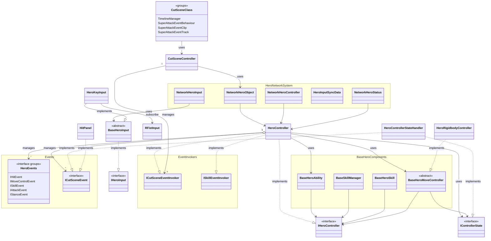
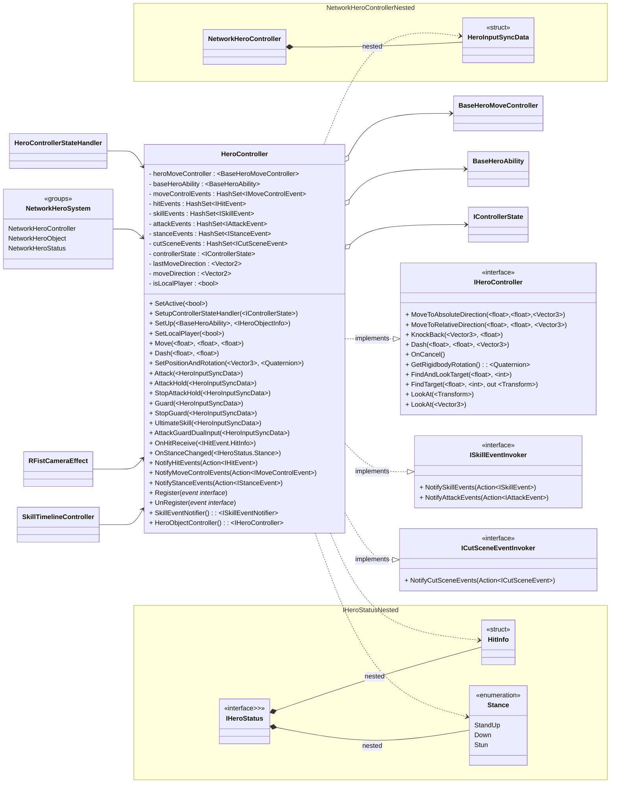
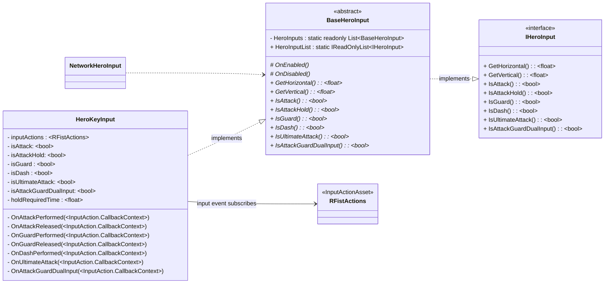
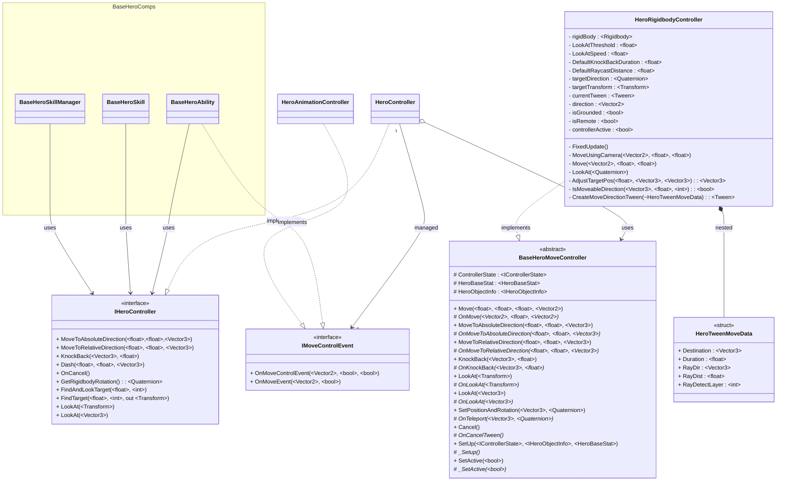
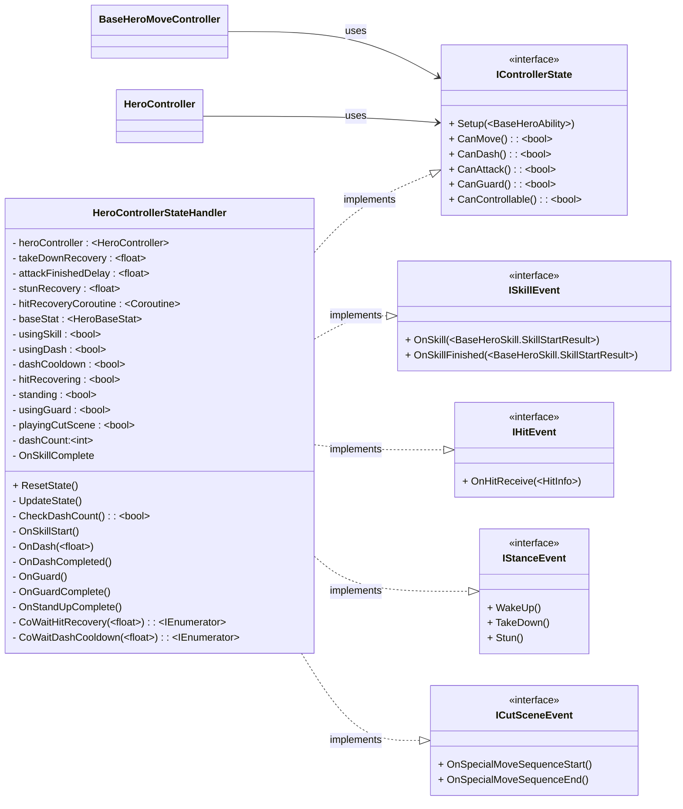
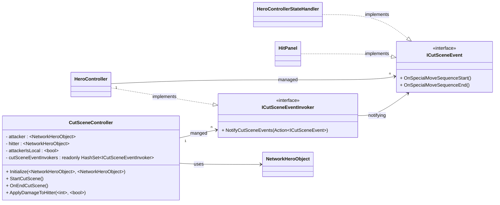

+++
title = "영웅 컨트롤 시스템(Hero Control System) 소개"
description = "RFist 게임의 영웅 캐릭터 입력, 이동, 상태 관리를 통합 제어하는 시스템"
icon = "sports_esports"
date = "2025-03-24T00:00:00+09:00"
lastmod = "2025-03-24T00:00:00+09:00"
draft = false
toc = true
weight = 201
+++

## 1. 기능 개요

- **HeroControlSystem**은 RFist 게임의 **영웅 캐릭터 제어 시스템**으로, **입력 처리, 이동 제어, 상태 관리, 컷씬 제어**를 통합적으로 관리하는 시스템입니다. 6가지 이벤트 타입을 기반으로 한 옵저버 패턴을 통해 애니메이션, 스킬, 피격 등의 시스템과 느슨하게 결합되어 동작합니다.

### 개발 배경 및 요구사항
- **다양한 입력 방식 지원**: 키보드, 게임패드 등 다양한 입력 디바이스를 추상화하여 일관된 인터페이스 제공
- **물리 기반 + 트윈 기반 이동**: Rigidbody 기반이동과 DoTween 기반 스킬 동작 이동 지원
- **상태 기반 행동 제어**: 스킬 사용, 피격, 다운, 쿨다운 등 상태에 따라 입력 가능 여부를 동적으로 제어
- **네트워크 동기화 지원**: Fusion 네트워크 환경에서 입력 데이터를 효율적으로 동기화
- **컷씬(궁극기) 제어**: Timeline 기반 특수 스킬 실행 중 캐릭터 제어 및 데미지 처리

### 주요 기능
 
| 기능 | 설명 |
|-----|-----|
|**입력 처리**| Input System 기반 키보드 입력 처리 및 네트워크 동기화용 데이터 구조 제공 |
|**이동 제어**| Rigidbody 기반 이동 + DoTween 트윈 기반 이동 지원 |
|**상태 관리**| 스킬/피격/가드/대시/컷씬/쿨다운 상태에 따른 행동 가능 여부 동적 관리 |
|**이벤트 관리 및 통지**| 6가지 이벤트 타입(MoveControl, Hit, Skill, Attack, Stance, CutScene) 옵저버 패턴 구현 |
|**컷씬 유틸리티**| Timeline 기반 궁극기 컷씬 중 이벤트 처리 및 데미지 적용 |


## 2. 사용된 기술 요소
### 핵심 기술 요소 및 API 활용


| 요소 | 설명 |
|-----|-----|
|**C#**| 전체 핵심 로직 및 유니티 컴포넌트 구현 |
|[**Input System**](https://docs.unity3d.com/Packages/com.unity.inputsystem@1.18/manual/index.html)| Action 기반 입력 처리 및 디바이스 독립적 입력 추상화 |
|[**DoTween**](https://dotween.demigiant.com/documentation.php)| 트윈 기반 이동(대시, 넉백, 스킬 동작) 구현 |
|[**Fusion**](https://doc.photonengine.com/fusion/v2/manual)| 네트워크 입력 동기화 및 RPC 기반 입력 데이터 전송 |
|├ [**NetworkInput**](https://doc.photonengine.com/fusion/v1/manual/network-input)| 입력 데이터 네트워크 동기화 |


### 설계 활용 패턴

| 요소 | 설명 |
|-----|-----|
|**옵저버 패턴 (Observer Pattern)**| HeroController에서 6가지 이벤트 타입을 관리하고, 관련 시스템(애니메이션, 스킬 등)에 이벤트 통지 |
|**템플릿 메서드 패턴 (Template Method Pattern)**| BaseHeroInput, BaseHeroMoveController에서 공통 인터페이스 정의 및 하위 클래스에서 구체적 구현 |
|**전략 패턴 (Strategy Pattern)**| IHeroInput 인터페이스를 통해 다양한 입력 구현체를 런타임에 교체 가능 |


## 3. 전체 시스템 구조도(간략)

## 4. 주요 클래스별 역할 및 관계
### 핵심 컨트롤러


| 클래스 | 역할 |
|-----|-----|
|[**HeroController**](/docs/projects/rfist/HeroControlSystem/herocontroller/)  *: IHeroController, IHeroDetector,*  *ISkillEventInvoker, ICutSceneEventInvoker*| 💡 영웅 캐릭터의 **중앙 제어 관리자**  💡 6가지 이벤트 타입의 등록 및 통지 시스템 관리  💡 입력 수신 → 상태 확인 → 이동/스킬 실행 흐름 제어  💡 컨트롤러 상태(IControllerState) 기반 행동 제어  💡 자동 타겟팅 및 방향 전환 처리 |


### 입력 처리 클래스


| 클래스 | 역할 |
|-----|-----|
|[**IHeroInput**](/docs/projects/rfist/HeroControlSystem/iheroinput/)  *<<interface>>*| 💡 영웅 입력 계약 정의   💡 이동/전투/포커스 입력값 제공   💡 입력 시스템 표준 인터페이스 |
|[**BaseHeroInput**](/docs/projects/rfist/HeroControlSystem/baseheroinput/)  *<<abstract>>*   *: IHeroInput, IHeroEvent*| 💡 입력 시스템의 **기반 추상 클래스**  💡 정적 리스트 `HeroInputList`로 인스턴스 중앙 관리  💡 템플릿 메서드 패턴으로 하위 클래스 확장 지원 |
|[**HeroKeyInput**](/docs/projects/rfist/HeroControlSystem/herokeyinput/)  : BaseHeroInput | _💡_ **Input System 기반 키보드/마우스 입력 처리**  💡 단발성/지속성 입력 구분 (IsAttack vs IsAttackHold)  💡 try-finally 패턴으로 자동 입력 리셋 구현 |



### 동작 제어 클래스

| 클래스 | 역할 |
|-----|-----|
|[**IHeroController**](/docs/projects/rfist/HeroControlSystem/iherocontroller/)  *<<interface>>*| 💡 영웅 이동 및 제어 기능 계약 정의  💡 DoTween 기반 절대/상대 이동, 넉백, 대시 인터페이스 제공   💡 타겟팅 및 방향전환 기능 정의   💡 Tween 동작 취소 기능 정의 |
|[**BaseHeroMoveController**](/docs/projects/rfist/HeroControlSystem/baseheromovecontroller/)  *<<abstract>>*| 💡 이동 제어의 **기반 추상 클래스**  💡 템플릿 메서드 패턴을 통한 구현체 확장 지원  💡 이동, 회전, 순간 이동, 넉백 등 기본 동작 정의 |
|[**HeroRigidbodyController**](/docs/projects/rfist/HeroControlSystem/herorigidbodycontroller/)  : BaseHeroMoveController| 💡 **Rigidbody/Tween 기반 이동 구현체**  💡 카메라 기준 상대 이동 및 회전 처리  💡 DoTween 트윈 이동 + 벽/아바타 충돌 감지  💡 넉백, 대시 등 특수 이동 구현 |
|[**IMoveControlEvent**](/docs/projects/rfist/HeroControlSystem/imovecontrolevent/)  *<<interface>>*| 💡 이동 입력 이벤트 및 실제 이동 발생 이벤트 정의  💡 이동 방향, 포커스 모드, 제어 가능 여부 전달 |


### 상태 관리 클래스


| 클래스 | 역할 |
|-----|-----|
|[**IControllerState**](/docs/projects/rfist/HeroControlSystem/icontrollerstate/)  *<<interface>>*| 💡 컨트롤러 상태 계약 정의 (CanMove, CanAttack, CanGuard, CanDash, CanControllable)   💡 상태 기반 행동 제어의 표준 인터페이스|
|[**HeroControllerStateHandler**](/docs/projects/rfist/HeroControlSystem/herocontrollerstatehandler/)  *: IControllerState, ISkillEvent, IHitEvent, IStanceEvent, ICutSceneEvent*| 💡 **상태 기반 행동 제어의 핵심 구현체**  💡 스킬 시작/종료, 피격, 자세 변경, 컷씬 등의 이벤트 수신 및 컨트롤 제한  💡 대시 횟수 및 쿨다운 관리 |


### 컷씬 관리 클래스


| 클래스 | 역할 |
|-----|-----|
|[**ICutSceneEvent**](/docs/projects/rfist/HeroControlSystem/icutsceneevent/)  *<<interface>>*| 💡 컷씬(특수 스킬) 시작/종료 이벤트 정의 |
|[**ICutSceneEventInvoker**](/docs/projects/rfist/HeroControlSystem/icutsceneeventinvoker/)  *<<interface>>*| 💡 컷씬 이벤트 발신자 역할 정의  💡 `NotifyCutSceneEvents()`로 모든 구독자에게 일괄 발신 |
|[**CutSceneController**](/docs/projects/rfist/HeroControlSystem/cutscenecontroller/) | 💡 `TimelineManager`에서 발생하는 컷씬 이벤트 처리 (시작/종료)  💡 컷씬 중 피격자에게 데미지 적용  💡 로컬/원격 플레이어 구분에 따른 공격 이벤트 처리 |


## 5. 주요 특징

### 기능의 특징

- **입력 추상화 계층**: `IHeroInput` 인터페이스와 `BaseHeroInput` 추상 클래스를 통해 키보드, 게임패드, 모바일 등 다양한 입력 방식을 추상화하고, `HeroInputData` 비트 마스크로 네트워크 효율성 극대화
- **이중 이동 시스템**: Rigidbody 기반 물리 이동(자유로운 이동)과 DoTween 기반 트윈 이동(정밀한 스킬 동작)을 상황에 맞게 선택 가능
- **상태 기반 행동 제어**: `IControllerState` 인터페이스를 통해 스킬 사용, 피격, 다운, 스턴, 컷씬 등의 상태에 따라 이동/공격/가드/대시 가능 여부를 정밀하게 제어
- **6중 이벤트 옵저버 패턴**: MoveControl, Hit, Skill, Attack, Stance, CutScene 6가지 이벤트 타입을 독립적으로 관리하여 애니메이션, 스킬, 피격 시스템과 느슨한 결합 유지
- **컷씬 제어 통합**: Timeline 기반 궁극기 컷씬 실행 중에도 캐릭터 상태 관리 및 데미지 처리가 가능한 통합 컨트롤 시스템

## 6. UseCase

### 전투 입력 처리 시나리오

1. **입력 수집**: `HeroKeyInput`이 Input System으로부터 키 입력을 감지
2. **네트워크 동기화**: `NetworkHeroInput`이 `BaseHeroInput.HeroInputList`에서 모든 입력 소스의 데이터를 수집하여 `HeroInputData`로 변환
3. **입력 전송**: Fusion `NetworkRunner`를 통해 모든 클라이언트에 입력 데이터 동기화
4. **입력 처리**: `HeroController`가 동기화된 입력을 수신하여 상태 확인 (`IControllerState.CanAttack` 등)
5. **동작 실행**: 상태가 허용하면 `BaseHeroAbility`를 통해 공격/가드/대시 등의 스킬 실행
6. **이벤트 통지**: 스킬 시작/종료 시 `HeroController.NotifySkillEvents()`로 관련 시스템에 이벤트 발신

### 피격 및 넉백 시나리오

1. **피격 수신**: `HeroController.OnHitReceive()`로 피격 정보 수신
2. **상태 전환**: `HeroControllerStateHandler.OnHitReceive()`에서 피격 회복 상태로 전환 및 `CanMove/CanAttack` 비활성화
3. **넉백 실행**: `HeroController.KnockBack()` → `HeroRigidbodyController.OnKnockBack()`으로 DoTween 기반 넉백 동작 실행
4. **상태 복원**: 회복 시간 경과 후 `UpdateState()`로 행동 가능 상태 복원

### 궁극기(컷씬) 실행 시나리오

1. **컷씬 시작**: `CutSceneController.StartCutScene()` 호출
2. **이벤트 발신**: `ICutSceneEventInvoker.NotifyCutSceneEvents()`로 모든 구독자에게 컷씬 시작 통지
3. **상태 제한**: `HeroControllerStateHandler.OnSpecialMoveSequenceStart()`에서 `_playingCutScene = true` 설정으로 모든 행동 제한
4. **데미지 처리**: Timeline 프레임 이벤트에서 `CutSceneController.ApplyDamageToHitter()`로 피격자 데미지 적용
5. **컷씬 종료**: `OnEndCutScene()`에서 `_playingCutScene = false` 설정으로 행동 가능 상태 복원

### 주요 사용처

- **PvP 전투 게임의 캐릭터 제어**: 입력 → 이동 → 스킬 → 피격의 전체 흐름 관리
- **네트워크 동기화 환경**: Fusion 기반 멀티플레이어 게임의 입력 동기화
- **복잡한 상태 머신이 필요한 캐릭터**: 스킬 캔슬, 피격 경직, 다운/스턴 등 다양한 상태 전환이 필요한 캐릭터
- **컷씬 기반 특수 스킬**: Timeline 연동 궁극기 시스템이 필요한 게임
