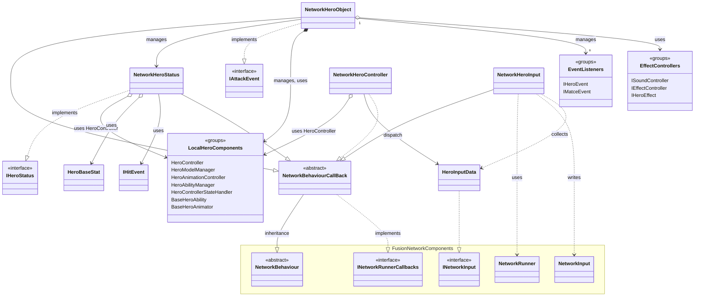
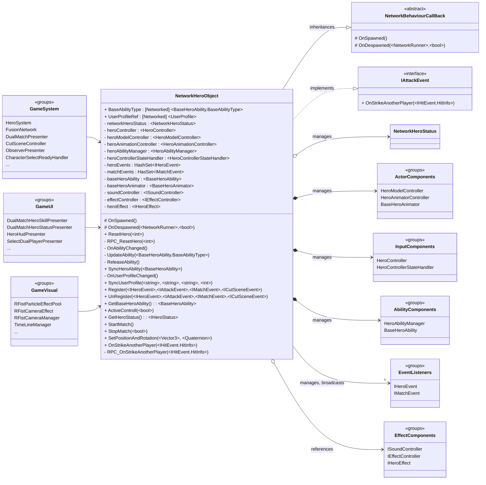
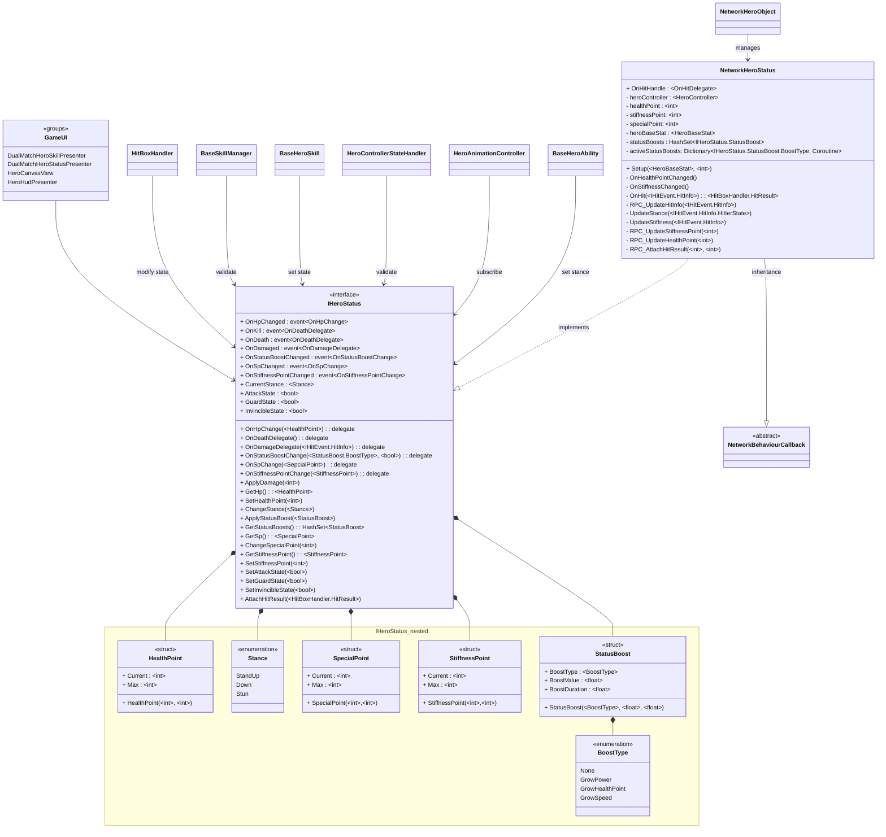
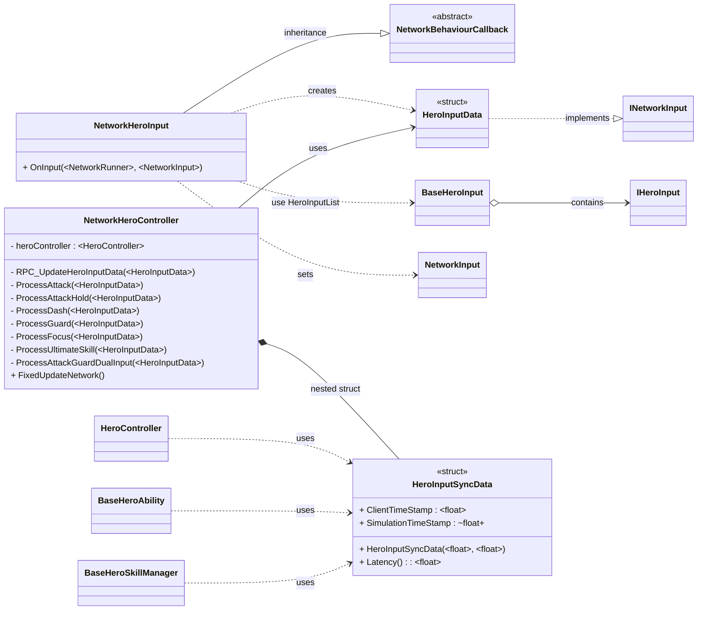

+++
title = "영웅 동기화 시스템 (Hero Network System) 소개"
description = "Photon Fusion 기반 영웅 네트워크 동기화 시스템"
icon = "lan"
date = "2026-03-01T18:00:00+09:00"
lastmod = "2026-03-01T18:00:00+09:00"
draft = false
toc = true
weight = 201
+++

## 1. 기능 개요
- **HeroNetworkSystem**은 RFist 게임의 **영웅 캐릭터 네트워크 동기화 시스템**으로, Photon Fusion2-Shared 기반의 네트워크 환경에서 영웅 오브젝트의 수명주기, 상태, 입력을 관리하고 동기화하는 시스템입니다.

### 개발 배경 및 요구사항
- **네트워크 환경에서 영웅 오브젝트의 일관된 상태 동기화**가 필요
- **로컬/원격 플레이어 간 입력 지연 최소화** 및 부드러운 동기화
- **HP, SP, 경직 포인트 등 전투 상태의 실시간 네트워크 동기화**
- **영웅 능력(Ability) 및 프로필 정보의 네트워크 동기화**
- **이벤트 기반 아키텍처**를 통한 느슨한 결합 및 확장성 확보

### 주요 기능

| 기능 | 설명 |
|-----|-----|
|**영웅 오브젝트 수명주기 관리**| 스폰/디스폰, 능력 변경, 컴포넌트 초기화 조율 |
|**네트워크 상태 동기화**| HP, SP, 경직 포인트, 자세(Stance) 등 상태 네트워크 동기화 |
|**네트워크 입력 처리**| 로컬 입력 수집 → 네트워크 전송 → 모든 클라이언트에서 실행 |
|**이벤트 기반 통신**| 영웅/스킬/공격/매치/컷씬 이벤트의 중앙 관리 및 브로드캐스트 |


 

---

## 2. 사용된 기술 요소
### 핵심 기술 요소 및 API 활용

| 요소 | 설명 |
|-----|-----|
|**C#**| 전체 핵심 로직 및 유니티 컴포넌트 구현 |
|[**Photon Fusion**](https://doc.photonengine.com/fusion/current/manual/overview)| 실시간 네트워크 동기화 및 멀티플레이어 게임 엔진 |
|├ [**NetworkBehaviour**](https://doc.photonengine.com/fusion/current/manual/network-behaviour)| Fusion의 네트워크 동기화 기반 클래스 |
|├ [**RPC (Remote Procedure Call)**](https://doc.photonengine.com/fusion/current/manual/rpc)| 원격 프로시저 호출을 통한 네트워크 이벤트 전파 |
|├ [**ChangeDetector**](https://doc.photonengine.com/fusion/current/manual/data-transfer/change-detection)| 네트워크 상태 변경 감지 및 처리 |
|├ [**NetworkInput**](https://doc.photonengine.com/fusion/v1/manual/network-input)| 입력 데이터 네트워크 동기화 |


### 설계 활용 패턴


| 요소 | 설명 |
|-----|-----|
|**Facade Pattern**|[`NetworkHeroObject`](/docs/projects/rfist/heronetworksystem/networkheroobject/)가 복잡한 하위 컴포넌트들을 캡슐화하여 단순한 인터페이스 제공 |
|**Observer Pattern**|이벤트 기반 통신으로 상태 변경 시 관련 컴포넌트에 자동 알림 |
|**RPC(Network)**|입력 권한을 가진 클라이언트에서 서버로, 서버에서 모든 클라이언트로 명령 전파 |
|**State Pattern(Network)**|`[Networked]` 속성을 통한 자동 상태 동기화 및 `ChangeDetector`로 변경 감지 |


 

---

## 3. 전체 시스템 구조도(간략)

---

## 4. 주요 클래스별 역할 및 관계
### 수명주기 및 네트워크 동기화 관리


| 클래스 | 역할 |
|-----|-----|
|[**NetworkHeroObject**](/docs/projects/rfist/heronetworksystem/networkheroobject/)| 💡 Facade: 영웅의 서브시스템을 단순화된 통합 인터페이스로 제공   💡 영웅 오브젝트의 전체 수명주기(스폰/디스폰) 관리  💡 능력(Ability) 및 프로필 네트워크 동기화  💡 모든 하위 컴포넌트 초기화 및 조율  💡 `IHeroEvent, IMatchEvent` 이벤트 라우팅 중앙화 (`Register`/`UnRegister`)   💡 외부 시스템에서 영웅 객체에 접근하는 진입점 | 


### 상태 관리


| 클래스 | 역할 |
|-----|-----|
|[**IHeroStatus**](/docs/projects/rfist/heronetworksystem/iherostatus/)  *<<interface>>*| 💡 영웅 상태 관리의 인터페이스 계약 정의  💡 HP, SP, 경직 포인트, 자세(Stance), 상태 효과(StatusBoost) 관리 메서드 정의  💡 상태 변경 이벤트(`OnHpChanged`, `OnDeath` 등) 정의 |
|[**NetworkHeroStatus**](/docs/projects/rfist/heronetworksystem/networkherostatus/)  *: NetworkBehaviourCallback, IHeroStatus*| 💡 `IHeroStatus` 인터페이스의 네트워크 구현체  💡 HP/SP/경직 포인트 네트워크 동기화(RPC)  💡 히트 처리 및 데미지 계산  💡 상태 효과(Status Boost) 및 타이머 관리|


### 입력 처리


| 클래스 | 역할 |
|-----|-----|
|[**NetworkHeroInput**](/docs/projects/rfist/heronetworksystem/networkheroinput/)  *: NetworkBehaviourCallback*| 💡 로컬 플레이어 입력 수집 및 네트워크 전송  💡 `NetworkInput` 시스템을 통한 입력 데이터 동기화  💡 이동, 공격, 가드, 대시, 궁극기 등 다양한 입력 처리 |
|[**NetworkHeroController**](/docs/projects/rfist/heronetworksystem/networkherocontroller/)  *: NetworkBehaviour*| 💡 네트워크로부터 입력 수신 및 실제 게임 로직 실행  💡 RPC를 통한 입력 데이터 브로드캐스트  💡 네트워크 지연(Latency) 측정을 위한 타임스탬프 동기화 |


---

## 5. 주요 특징
### 기능의 특징
- **네트워크 상태 동기화**: `[Networked]` 속성과 [`ChangeDetector`](https://doc.photonengine.com/fusion/current/manual/data-transfer/change-detection)를 활용한 자동 상태 동기화 및 변경 감지
- **이벤트 기반 아키텍처**: `IHeroEvent`, `ISkillEvent`, `IAttackEvent` 등 인터페이스 기반 이벤트 시스템으로 느슨한 결합 구현
- **파사드 패턴 적용**: [`NetworkHeroObject`](/docs/projects/rfist/HeroNetworkSystem/NetworkHeroObject)가 하위 컴포넌트들을 캡슐화하여 외부에 단순한 인터페이스 제공
- **로컬 입력 브로드캐스팅**: [`NetworkHeroInput`](/docs/projects/rfist/HeroNetworkSystem/networkheroinput) → [`NetworkHeroController`](/docs/projects/rfist/HeroNetworkSystem/networkherocontroller) → [`HeroController`](/docs/projects/rfist/HeroControlSystem/HeroController) 흐름으로 로컬 입력을 처리
- **RPC 기준 제어**: 입력 권한(`InputAuthority`)을 가진 클라이언트만 RPC 호출 가능하도록 제한
- **컴포넌트 자동 초기화**: `UpdateAbility()` 메서드에서 능력 변경 시 모든 관련 컴포넌트를 자동으로 재설정

---

## 6. UseCase
### 영웅 스폰 및 능력 동기화 시나리오
1. **스폰**: [`NetworkHeroObject`](/docs/projects/rfist/HeroNetworkSystem/NetworkHeroObject)가 네트워크에 스폰되면 `OnSpawned()` 호출
2. **프로필 동기화**: `SyncUserProfile()`로 사용자 정보(이름, 팀, 프로필 이미지) 동기화
3. **능력 동기화**: `SyncHeroAbility()`로 영웅 능력 타입 동기화 → `BaseAbilityType` 변경 감지
4. **컴포넌트 초기화**: `OnAbilityChanged()` → `UpdateAbility()`에서 모든 하위 컴포넌트 설정

### 전투 상태 동기화 시나리오
1. **피격**: `HitBoxHandler`에서 `OnHitHandle` 델리게이트 호출
2. **데미지 적용**: [`NetworkHeroStatus.OnHit()`](/docs/projects/rfist/heronetworksystem/networkherostatus/)에서 데미지 계산 및 `RPC_UpdateHitInfo()` 호출
3. **상태 변경**: 모든 클라이언트에서 HP 감소 및 자세(Stance) 변경
4. **이벤트 발생**: `OnHpChanged`, `OnDamaged` 이벤트 발생 → UI 업데이트
5. **사망 처리**: HP가 0 이하가 되면 `OnDeath` 이벤트 발생 → 컨트롤러 비활성화

### 네트워크 입력 처리 시나리오
1. **입력 수집**: [`NetworkHeroInput.OnInput()`](/docs/projects/rfist/HeroNetworkSystem/networkheroinput)에서 로컬 입력 수집
2. **입력 전송**: [`NetworkInput`](https://doc.photonengine.com/fusion/v1/manual/network-input)을 통해 네트워크로 입력 데이터 전송
3. **입력 수신**: [`NetworkHeroController.FixedUpdateNetwork`](/docs/projects/rfist/HeroNetworkSystem/networkherocontroller)에서 입력 수신
4. **RPC 브로드캐스트**: `RPC_UpdateHeroInputData()`로 모든 클라이언트에 입력 동기화
5. **동작 실행**: 모든 클라이언트에서 동일한 입력으로 [`HeroController`](/docs/projects/rfist/HeroControlSystem/HeroController) 메서드 호출

### 주요 사용처
- **멀티플레이어 대전 시스템**: 1v1 또는 팀 대전에서 영웅 캐릭터 동기화
- **관전 시스템**: 원격 플레이어의 영웅 상태 및 동작 실시간 관전
- **매치 메이킹**: 라운드 시작/종료 시 영웅 상태 초기화 및 동기화
