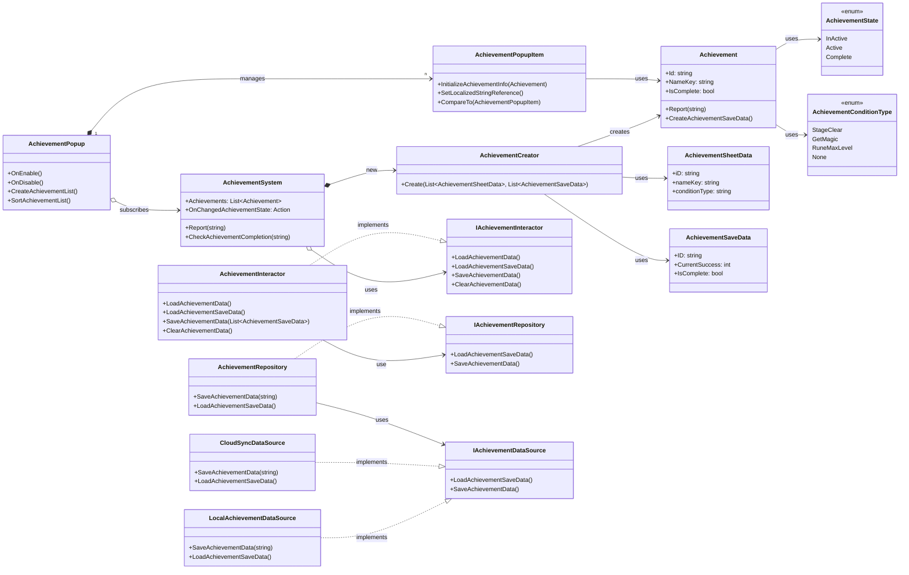
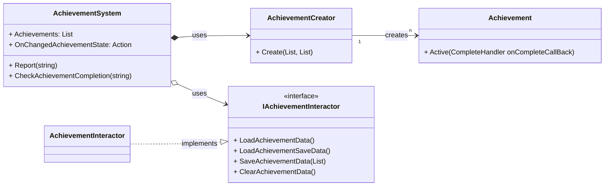
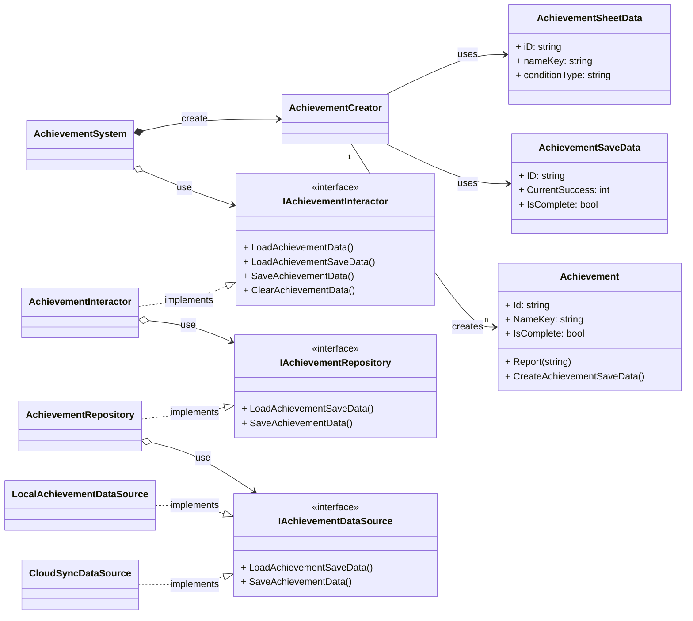
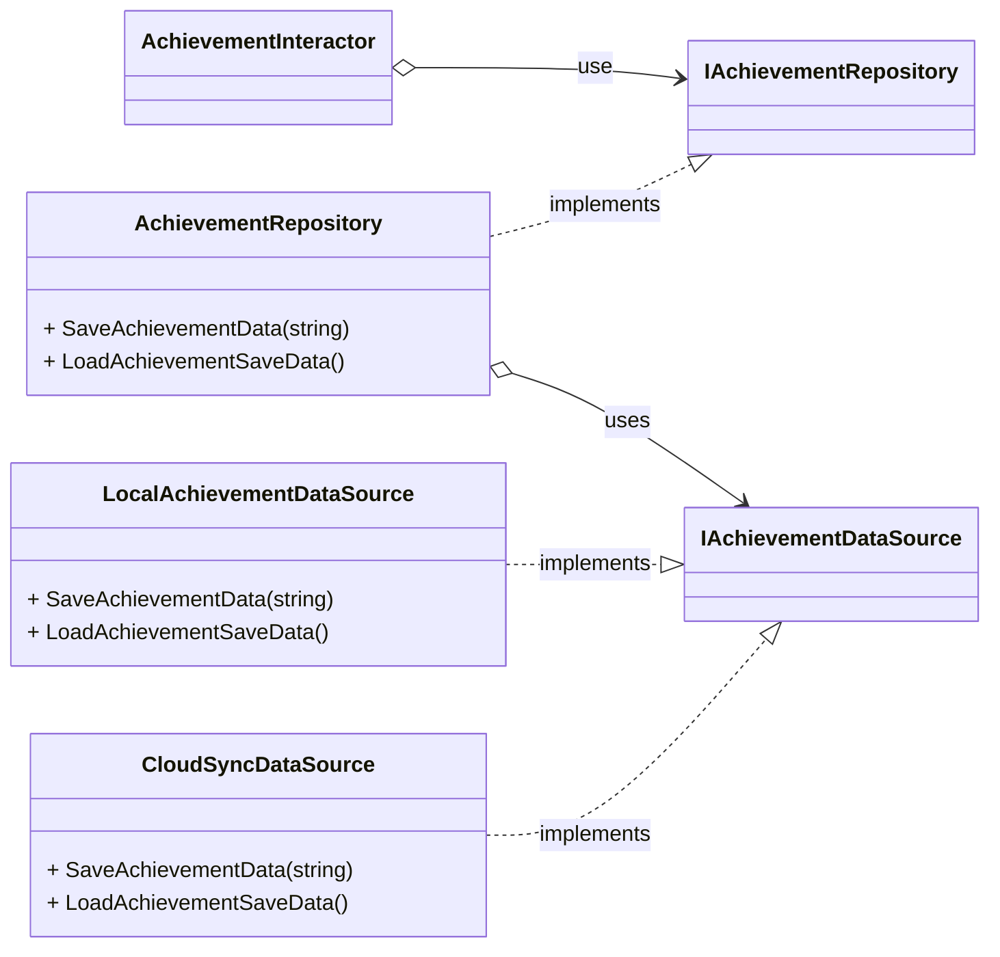
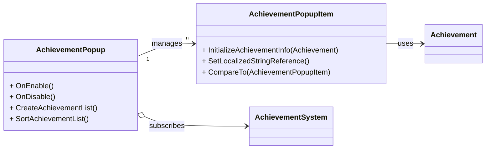

+++
title = "AchievementSystem 소개"
description = "SlimeRush 게임의 업적 시스템"
icon = "military_tech"
date = "2026-01-16T00:00:00+09:00"
lastmod = "2026-01-16T00:00:00+09:00"
draft = false
toc = true
weight = 201
+++

## 1. 기능 개요
- **AchievementSystem**은 SlimeRush 게임의 업적 시스템으로, 플레이어의 게임 진행 상황을 추적하고 업적 달성 시 보상을 제공하는 통합 시스템입니다. 이 시스템은 업적의 생성, 상태 관리, 진행 상황 추적, 데이터 저장 및 로드를 중앙에서 관리하며, 다양한 조건 타입을 지원하여 게임 내 다양한 이벤트와 연동할 수 있습니다.
- **제작기간**: 2024.09 ~ 2024.11
- **시스템 개발 인원**: 1인 (유니티 클라이언트 1인, UI 디자인 1인)

### 개발 배경 및 요구사항
- 플레이어의 게임 진행 상황을 추적하고 성취도를 시각적으로 표시
- 업적 달성을 통해 게임 요소 해금
- 다양한 업적 조건 타입 지원 (스테이지 클리어, 마법 획득, 룬 최대 레벨 등)
- 업적 데이터의 영구 저장 및 클라우드 동기화 지원
- 업적 시스템과 UI의 분리 및 유연한 확장성 제공
- 의존성 주입을 통한 테스트 용이성 및 유지보수성 향상

### 주요 기능

| 기능 | 설명 |
|-----|-----|
| **업적 생성 및 관리** | 시트 데이터와 저장 데이터를 결합하여 업적 객체 생성 및 관리 |
| **상태 관리** | 업적의 비활성, 활성, 완료 상태 관리 및 전환 |
| **진행 상황 추적** | 업적 조건 달성 횟수 추적 및 완료 조건 검증 |
| **데이터 영속성** | 로컬 및 클라우드 저장소를 통한 업적 데이터 저장 및 로드 |
| **이벤트 알림** | 업적 상태 변경 시 이벤트 발생 및 UI 자동 업데이트 |
| **선행 조건 시스템** | 선행 조건 업적 검사 및 자동 활성화 |
| **로컬라이제이션 지원** | 다국어 지원을 위한 로컬라이제이션 시스템 통합 |
| **업적 팝업 UI** | 업적 목록 표시 및 상태별 정렬 기능 |
 

## 2. 사용된 기술 요소
### 핵심 기술 요소 및 API 활용

| 요소 | 설명 |
|-----|-----|
| **C#** | 전체 핵심 로직 및 유니티 컴포넌트 구현 |
| **Unity Localization** | 다국어 지원 및 로컬라이제이션 관리 |
| **Zenject** | 객체 간 의존성 주입을 자동화하여 높은 응집도와 낮은 결합도 구현 |
| **Newtonsoft.Json** | JSON 직렬화/역직렬화를 통한 데이터 저장 및 로드 |
| **Steamworks.NET** | Steam 클라우드 저장소와 연동 |
 

### 설계 활용 패턴

| 요소 | 설명 |
|-----|-----|
| **Clean Architecture** | Presentation, Domain, Data 계층을 명확히 분리하여 유지보수 및 확장성 극대화 |
| **Repository Pattern** | 데이터 접근 추상화를 통한 유연한 데이터 소스 관리 |
| **Dependency Injection** | 의존성 주입을 통한 테스트 용이성 및 유연한 아키텍처 구현 |
| **Observer Pattern** | 업적 상태 변경 시 관련 모듈에 실시간 알림 |
| **Strategy Pattern** | 다양한 업적 조건 타입을 유연하게 확장 가능 |
 

## 3. 전체 시스템 구조도(간략)

  

## 4. 주요 클래스별 역할 및 관계
### 업적 시스템 관리

| 클래스 | 역할 |
|-----|-----|
| **[AchievementSystem](/docs/projects/rfice/SlimeRush/AchievementSystem/AchievementSystem)** | 업적 시스템의 핵심 관리자, 상태 관리, 진행 상황 추적, 데이터 저장/로드 |
| **[AchievementCreator](/docs/projects/rfice/SlimeRush/AchievementSystem/AchievementCreator)** | 시트 데이터와 저장 데이터를 결합하여 업적 객체 생성 |
| **[AchievementInteractor](/docs/projects/rfice/SlimeRush/AchievementSystem/AchievementInteractor)**   --> IAchievementInteractor| 데이터 인터랙터 구현체, JSON 직렬화/역직렬화 처리 |
 

  

### 데이터 모델 및 인터페이스

| 클래스 | 역할 |
|-----|-----|
| **[Achievement](/docs/projects/rfice/SlimeRush/AchievementSystem/Achievement)** | 개별 업적 데이터 모델, 상태 관리, 이벤트 처리 |
| **[AchievementSheetData](/docs/projects/rfice/SlimeRush/AchievementSystem/AchievementSheetData)** | 게임 디자인 데이터 모델 |
| **[AchievementSaveData](/docs/projects/rfice/SlimeRush/AchievementSystem/AchievementSaveData)** | 플레이어 진행 상황 데이터 모델 |
| **[IAchievementInteractor](/docs/projects/rfice/SlimeRush/AchievementSystem/IAchievementInteractor)** *<<interface>>* | 데이터 인터랙터 인터페이스 |
| **[IAchievementRepository](/docs/projects/rfice/SlimeRush/AchievementSystem/IAchievementRepository)** *<<interface>>* | 저장소 인터페이스 |
| **[IAchievementDataSource](/docs/projects/rfice/SlimeRush/AchievementSystem/IAchievementDataSource)** *<<interface>>* | 데이터 소스 인터페이스 |
 

  

### 데이터 저장소 및 소스

| 클래스 | 역할 |
|-----|-----|
| **[AchievementRepository](/docs/projects/rfice/SlimeRush/AchievementSystem/AchievementRepository)**   --> IAchievementRepository | 저장소 패턴 구현, 데이터 소스 추상화 |
| **[LocalAchievementDataSource](/docs/projects/rfice/SlimeRush/AchievementSystem/LocalAchievementDataSource)**   --> IAchievementDataSource | 로컬 파일 시스템 데이터 소스 |
| **[CloudSyncDataSource](/docs/projects/rfice/SlimeRush/AchievementSystem/CloudSyncDataSource)**   --> IAchievementDataSource | Steam 클라우드 저장소 데이터 소스 |
 

  

### 상태 및 조건 관리

| 클래스 | 역할 |
|-----|-----|
| **[AchievementState](/docs/projects/rfice/SlimeRush/AchievementSystem/AchievementState)** | 업적 상태 열거형 (InActive, Active, Complete) |
| **[AchievementConditionType](/docs/projects/rfice/SlimeRush/AchievementSystem/AchievementConditionType)** | 업적 조건 타입 열거형 (StageClear, GetMagic, RuneMaxLevel, None) |
 

### UI 컴포넌트

| 클래스 | 역할 |
|-----|-----|
| **[AchievementPopup](/docs/projects/rfice/SlimeRush/AchievementSystem/AchievementPopup)** | 업적 팝업 UI 관리, 업적 목록 표시 및 자동 업데이트 |
| **[AchievementPopupItem](/docs/projects/rfice/SlimeRush/AchievementSystem/AchievementPopupItem)** | 개별 업적 아이템 UI, 로컬라이제이션 및 정렬 기능 |
 

  

## 5. 주요 특징
### 기능의 특징
- **유연한 업적 조건 시스템**: 다양한 조건 타입을 지원하고 확장 가능
- **데이터 영속성**: 로컬 및 클라우드 저장소를 통한 데이터 동기화
- **상태 관리**: 업적의 생명 주기 관리 및 자동 상태 전환
- **이벤트 기반 아키텍처**: 업적 상태 변경 시 자동 UI 업데이트
- **로컬라이제이션 지원**: 다국어 지원을 위한 통합 시스템
- **의존성 주입**: 테스트 용이성 및 유지보수성 향상
- **클라우드 동기화**: Steam 클라우드를 통한 여러 기기 간 데이터 공유

## 6. UseCase
### 업적 달성 시나리오
1. **업적 초기화**: 게임 시작 시 업적 시스템 초기화 및 데이터 로드
2. **업적 활성화**: 선행 조건 만족 시 업적 자동 활성화
3. **조건 달성**: 게임 진행 중 조건 달성 시 진행 상황 업데이트
4. **업적 완료**: 모든 조건 달성 시 업적 완료 처리 및 보상 지급
5. **상태 저장**: 게임 종료 시 진행 상황 자동 저장
6. **UI 표시**: 업적 팝업을 통해 달성 현황 확인

### 주요 사용처
- 게임 내 성취도 시스템
- 플레이어 동기 부여 및 보상 시스템
- 게임 진행 상황 추적 및 분석
- 소셜 기능과 연동된 업적 공유
- 게임 내 이벤트 및 프로모션 연동
