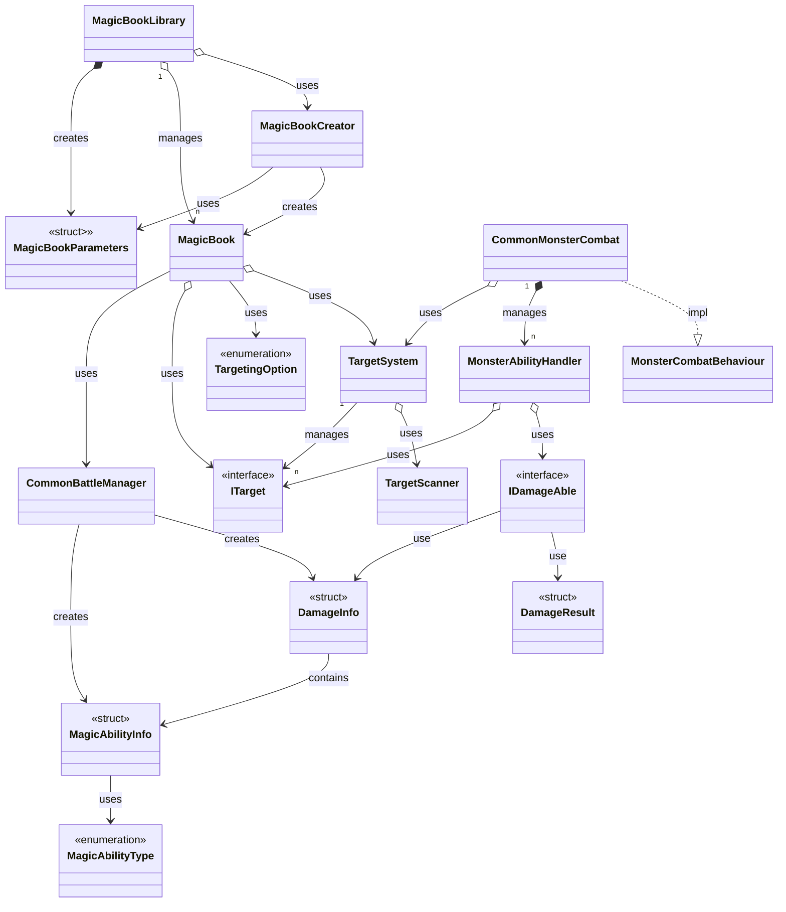
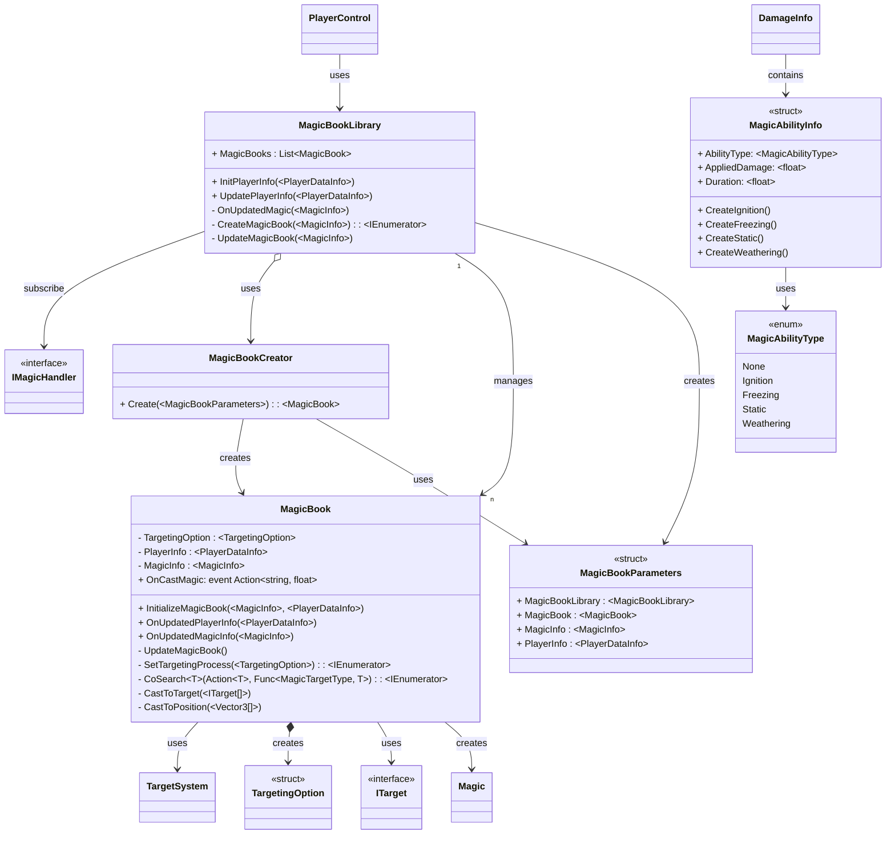
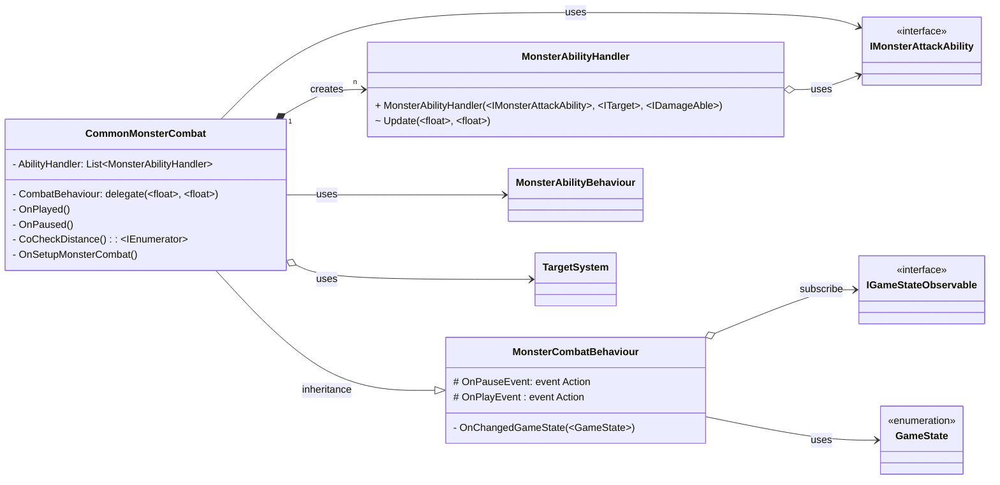
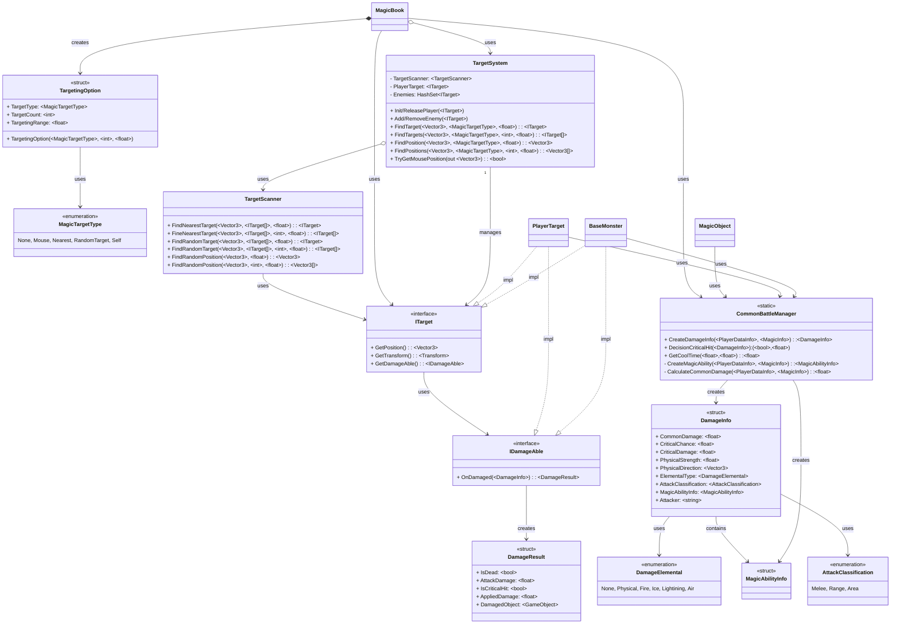

+++
title = "전투 시스템(Battle System) 소개"
description = "SlimeRush 게임의 전투 시스템"
icon = "swords"
date = "2026-01-28T00:00:00+09:00"
lastmod = "2026-01-28T00:00:00+09:00"
draft = false
toc = true
weight = 201
+++

## 1. 기능 개요
- **BattleSystem**은 SlimeRush 게임의 핵심 전투 관리 시스템으로, 플레이어와 몬스터 간의 전투 로직을 중앙에서 관리하는 통합 시스템입니다. 이 시스템은 데미지 계산, 타겟팅, 마법 시스템, 몬스터 행동 등을 포괄적으로 처리하며, 실시간 전투 상황을 정확하게 구현합니다.
- **제작기간**: 2024.09 ~ 2024.11
- **담당범위**
  - 플레이어
    - 마법 생성 및 관리([`MagicBookLibrary`](/docs/projects/SlimeRush/BattleSystem/MagicBookLibrary),
      [`MagicBookParameters`](/docs/projects/SlimeRush/BattleSystem/MagicBookParameters), [`MagicBookCreator`](/docs/projects/SlimeRush/BattleSystem/MagicBookCreator))
    - 마법 핸들링 및 타겟팅([`MagicBook`](/docs/projects/SlimeRush/BattleSystem/MagicBook))
    - 마법 부가 효과 설정([`MagicAbilityInfo`](/docs/projects/SlimeRush/BattleSystem/MagicAbilityInfo), [`MagicAbilityType`](/docs/projects/SlimeRush/BattleSystem/MagicAbilityType))
  - 몬스터
    - 몬스터 공격 능력 핸들링([`CommonMonsterCombat`](/docs/projects/SlimeRush/BattleSystem/CommonMonsterCombat),
      [`MonsterCombatBehaviour`](/docs/projects/SlimeRush/BattleSystem/MonsterCombatBehaviour))
    - 몬스터 개별 능력 쿨타임, 정거리 관리 및 공격 명령([`MonsterAbilityHandler`](/docs/projects/SlimeRush/BattleSystem/MonsterAbilityHandler))
  - 공통
    - 전투 관련 유틸리티, 데미지 관련 인터페이스 및 구조체([`CommonBattleManager`](/docs/projects/SlimeRush/BattleSystem/CommonBattleManager), [`IDamageAble`](/docs/projects/SlimeRush/BattleSystem/IDamageAble), [`DamageInfo`](/docs/projects/SlimeRush/BattleSystem/DamageInfo), [`DamageResult`](/docs/projects/SlimeRush/BattleSystem/DamageResult)) 
    - 타겟팅 시스템, 타겟정의 및 타겟 스캐닝([`ITarget`](/docs/projects/SlimeRush/BattleSystem/ITarget), [`TargetingOption`](/docs/projects/SlimeRush/BattleSystem/TargetingOption), [`TargetScanner`](/docs/projects/SlimeRush/BattleSystem/TargetScanner), [`TargetSystem`](/docs/projects/SlimeRush/BattleSystem/TargetSystem))

### 개발 배경 및 요구사항
- **플레이어의 표준 전투 및 데미지를 정의** 할 수 있는 로직 구현
- 다양한 마법 타입과 시전 방식을 지원하는 **확장 가능한 마법 시스템 구축**
- **다양한 타겟팅 옵션과 정확한 타겟 추적** 기능 제공
- 상황에 따른 **몬스터의 전투 행동** 기능 제공
- 대규모 전투 상황에서도 안정적인 성능을 유지할 수 있는 시스템 설계
- **새로운 전투 요소 추가와 코드 유지보수**를 용이하게 하는 아키텍처 구현

### 주요 기능

| 기능 | 설명 |
|-----|-----|
| **마법 생성 및 관리** | 마법책 라이브러리(중앙관리) 기반의 마법 생성, 업데이트, 관리 |
| **마법 발동 시스템** | 개별 마법책 객체의 실시간 쿨타임 관리, 타겟팅 옵션 적용, 마법 시전 처리 |
| **몬스터 공격 능력 관리** | 몬스터 공격 능력 관리, 거리 기반 전투 행동 결정 |
| **몬스터 공격 능력 핸들링** | 몬스터의 다중/단일 공격 능력 처리, 쿨타임 관리, 거리 감지 |
| **데미지 계산 시스템** | 통상 데미지 공식 구현, 크리티컬 히트, 룬 시스템 연동 |
| **데미지 정보/결과 관리** | 데미지 데이터 구조화, 속성 변환, 최종 적용 결과 제공 |
| **타겟 정의 및 서칭** | 타겟 인터페이스 표준화, 다양한 타겟팅 옵션 지원 |
| **실시간 타겟 추적** | 플레이어와 적 사이의 거리 실시간 감시 및 추적 |
 

## 2. 사용된 기술 요소
### 핵심 기술 요소 및 API 활용

| 요소 | 설명 |
|-----|-----|
| **C#** | 전체 핵심 로직 및 유니티 컴포넌트 구현 |
| [**Zenject**](https://github.com/modesttree/Zenject) | 객체 간 의존성 주입을 자동화하여 높은 응집도와 낮은 결합도 구현 |
| **Coroutine** | 실시간 쿨타임 관리 및 타겟 추적 코루틴 처리 |
| **Unity Event** | 이벤트 기반 객체 셋업 및 상태 이벤트 기반 동작 |
 

### 설계 활용 패턴

| 요소 | 설명 |
|-----|-----|
| **Component-Based Architecture** | 유니티 컴포넌트 기반 설계로 전투 시스템 모듈화 및 재사용성 극대화
| **Strategy Pattern** | 다양한 타겟팅 타입(마우스, 근처, 랜덤 등)을 유연하게 확장 가능 |
| **Factory Pattern** | 마법책 생성을 위한 전문화된 팩토리 클래스 구현 |
| **Observer Pattern** | 데미지 이벤트, 전투 상태 변경 시 관련 모듈에 실시간 알림 |
| **Dependency Injection** | 의존성 주입을 통한 테스트 용이성 및 유연한 아키텍처 구현 |
 

## 3. 전체 시스템 구조도(간략)


  

## 4. 주요 클래스별 역할 및 관계
### 플레이어 마법 관리 시스템


| 클래스 | 역할 |
|-----|-----|
| **[MagicBookLibrary](/docs/projects/SlimeRush/BattleSystem/MagicBookLibrary)** | 마법책([`MagicBook`](/docs/projects/SlimeRush/BattleSystem/MagicBook))객체를 생성하기 위한 파라메터([`MagicBookParameters`](/docs/projects/SlimeRush/BattleSystem/MagicBookParameters))를 생성하고 활성화된 마법책을 중앙에서 관리하는 클래스, 마법 할당 이벤트 구독 및 처리 |
| **[MagicBookCreator](/docs/projects/SlimeRush/BattleSystem/MagicBookCreator)**   : PlaceholderFactory<MagicBookParameters, MagicBook> | 파라메터([`MagicBookParameters`](/docs/projects/SlimeRush/BattleSystem/MagicBookParameters))를 통해 마법책([`MagicBook`](/docs/projects/SlimeRush/BattleSystem/MagicBook))을 생성하는 전용 팩토리 클래스|
| **[MagicBook](/docs/projects/SlimeRush/BattleSystem/MagicBook)** | 마법 쿨타임 관리, 타겟팅 대상을 타겟 시스템([`TargetSystem`](/docs/projects/SlimeRush/BattleSystem/TargetSystem))을 통해 추적하고 및 마법 객체(`🧑‍💻Magic`) 클래스 생성 및 타겟 전달
| **[MagicBookParameters](/docs/projects/SlimeRush/BattleSystem/MagicBookParameters)** | [`MagicBookCreator`](/docs/projects/SlimeRush/BattleSystem/MagicBookCreator) 클래스에서 [`MagicBook`](/docs/projects/SlimeRush/BattleSystem/MagicBook) 객체를 만들기 위한 매개변수를 가진 구조체 |
| **[MagicAbilityInfo](/docs/projects/SlimeRush/BattleSystem/MagicAbilityInfo)** | 마법의 부가 효과 정보를 저장하는 구조체 |
| **[MagicAbilityType](/docs/projects/SlimeRush/BattleSystem/MagicAbilityType)** | 마법의 부가 효과 종류를 정의하는 열거형 |
 

  

### 몬스터 시스템

| 클래스 | 역할 |
|-----|-----|
| **[MonsterCombatBehaviour](/docs/projects/SlimeRush/BattleSystem/MonsterCombatBehaviour)** | 게임 상태 이벤트(`🧑‍💻IGameStateObservable`) 리스닝 및 상태별 동작 이벤트 호출 |
| **[CommonMonsterCombat](/docs/projects/SlimeRush/BattleSystem/CommonMonsterCombat)** : MonsterCombatBehaviour | 게임 상태별 몬스터 동작. 타겟 시스템([`TargetSystem`](/docs/projects/SlimeRush/BattleSystem/TargetSystem))을 통해 플레이어와 거리 체크  몬스터 능력 핸들러([`MonsterAbilityHandler`](/docs/projects/SlimeRush/BattleSystem/MonsterAbilityHandler)) 생성, 관리 |
| **[MonsterAbilityHandler](/docs/projects/SlimeRush/BattleSystem/MonsterAbilityHandler)** | 몬스터 능력(`🧑‍💻IMonsterAttackAbility`) 핸들러, 개별 공격 능력 처리, 쿨타임 관리, 공격 범위 감지 |
 

  

### 공통 시스템

| 클래스 | 역할 |
|-----|-----|
| **[CommonBattleManager](/docs/projects/SlimeRush/BattleSystem/CommonBattleManager)** | 플레이어 정보([`플레이어시트데이터(예시)`](/docs/projects/SlimeRush/BattleSystem/ExamplePlayerSheetData))와 마법정보([`마법시트데이터(예시)`](/docs/projects/SlimeRush/BattleSystem/ExampleMagicSheetData)) 바탕으로 데미지 구조체([`DamageInfo`](/docs/projects/SlimeRush/BattleSystem/DamageInfo)) 생성 및 데미지 공식([`예시전투공식`](/docs/projects/SlimeRush/BattleSystem/CombatFormula)) 구현.  쿨타임, 마법 부가능력([`MagicAbilityInfo`](/docs/projects/SlimeRush/BattleSystem/MagicAbilityInfo)) 설정, 크리티컬 결정 등을 하는 정적 클래스 |
| **[IDamageAble](/docs/projects/SlimeRush/BattleSystem/IDamageAble)** | 데미지를 입을 수 있는 객체를 정의하는 인터페이스, 표준화된 데미지 처리 정의 |
| **[DamageInfo](/docs/projects/SlimeRush/BattleSystem/DamageInfo)** | 데미지 정보 구조체, 일반/치명타 데미지, 확률, 물리력 등 핵심 속성 포함 |
| **[DamageResult](/docs/projects/SlimeRush/BattleSystem/DamageResult)** | 데미지 적용 결과를 담는 구조체, 실제 적용된 데미지 값과 치명타 여부, 대상 객체의 사망 여부 추적 |
| **[ITarget](/docs/projects/SlimeRush/BattleSystem/ITarget)** | 타겟이 될 수 있는 오브젝트 정의. 위치(`Vector3`), `Transform`, 데미지 가능 객체([`IDamageAble`](/docs/projects/SlimeRush/BattleSystem/IDamageAble)) 접근 인터페이스 제공 |
| **[TargetingOption](/docs/projects/SlimeRush/BattleSystem/TargetingOption)** | 마법 타겟팅 옵션 정의 구조체, 타겟 타입(단일/다중/위치), 수량, 범위 설정 |
| **[TargetScanner](/docs/projects/SlimeRush/BattleSystem/TargetScanner)** | 타겟 탐색 및 위치 찾기 전용 클래스, 거리 기반 타겟 정렬 및 필터링, 랜덤 타겟 선택 |
| **[TargetSystem](/docs/projects/SlimeRush/BattleSystem/TargetSystem)** | 타겟 객체([`ITarget`](/docs/projects/SlimeRush/BattleSystem/ITarget)) 관리 및 타겟 스캔 명령 처리, 마우스 레이캐스트 기반 위치 감지 |
 

  

## 5. 주요 특징
### 기능의 특징
- **플레이어 데미지 정보**: 기본 데미지 + 속성 보너스 + 크기 보너스 + 크리티컬 + 룬 효과 적용
- **타겟팅 시스템**: 단일/다중 타겟, 위치 기반 시전, 마우스 지정 등 다양한 시전 방식 지원
- **실시간 쿨타임 관리**: 타이밍 제어 및 시각적 피드백 제공, 코루틴 기반 처리
- **몬스터 공격 행동 제어**: 거리 기반 전투 행동 결정, 다중 공격 능력 동시 관리, 게임 상태에 따라 행동 결정
- **의존성 주입 아키텍처**: Zenject 기반 DI, 객체 생성과 의존성 관리 자동화
- **확장 가능한 설계**: 플러그인 가능한 마법 시스템, 새로운 마법 타입 쉽게 추가 가능

## 6. UseCase
### 마법 시전 시나리오
1. **마법 할당**: 플레이어가 마법을 획득하면 [`MagicBookLibrary`](/docs/projects/SlimeRush/BattleSystem/MagicBookLibrary) 마법책 생성
2. **쿨타임 관리**: [`MagicBook`](/docs/projects/SlimeRush/BattleSystem/MagicBook) 실시간 쿨타임 체크 및 타이밍 제어
3. **타겟팅 결정**: [`TargetingOption`](/docs/projects/SlimeRush/BattleSystem/TargetingOption)에 따라 타겟 탐색 및 위치 지정
4. **마법 시전**: `🧑‍💻 MagicFactory`를 통해 마법 객체 생성 및 시전 효과 재생
5. **데미지 적용**: [`CommonBattleManager`](/docs/projects/SlimeRush/BattleSystem/CommonBattleManager)에서 데미지 계산 후 적용
6. **결과 처리**: [`DamageResult`](/docs/projects/SlimeRush/BattleSystem/DamageResult)를 통해 대상 객체의 사망 여부 및 최종 데미지 확인

### 몬스터 전투 시나리오
1. **거리 감지**: [`CommonMonsterCombat`](/docs/projects/SlimeRush/BattleSystem/CommonMonsterCombat)에서 플레이어와의 거리 실시간 체크
2. **능력 선택**: [`MonsterAbilityHandler`](/docs/projects/SlimeRush/BattleSystem/MonsterAbilityHandler)에서 공격 범위 내 타겟 감지
3. **쿨타임 체크**: 공격 가능 여부 확인 및 쿨타임 관리
4. **공격 실행**: 몬스터 공격 능력 실행 및 데미지 적용
5. **상태 전환**: 공격 후 쿨타임 설정 및 다음 공격 준비

### 주요 사용처
- 플레이어 마법 관리 시스템
- 몬스터 공격 행동 제어
- 데미지 계산 및 적용 시스템
- 타겟팅 및 시전 위치 결정
- 전투 상태 관리 및 쿨타임 제어
- 게임 내 전투 이벤트 및 콤보 시스템