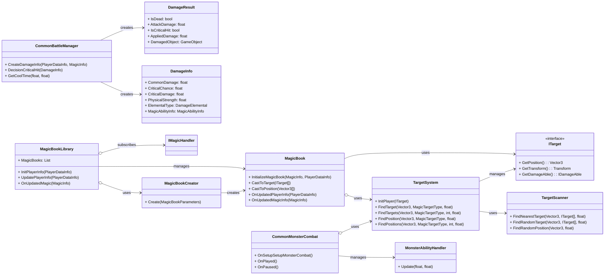
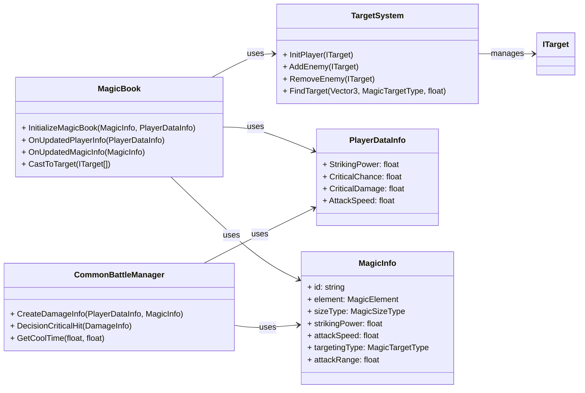
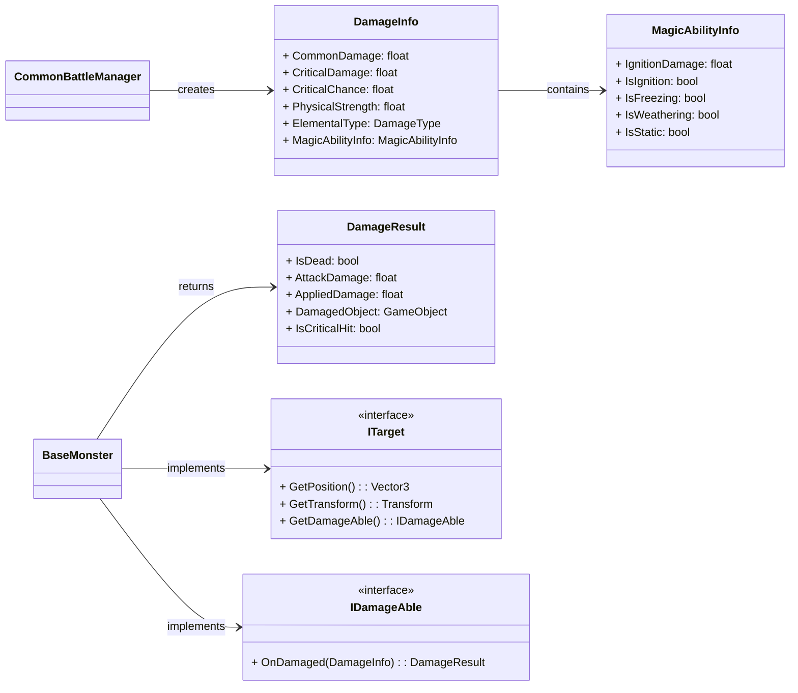
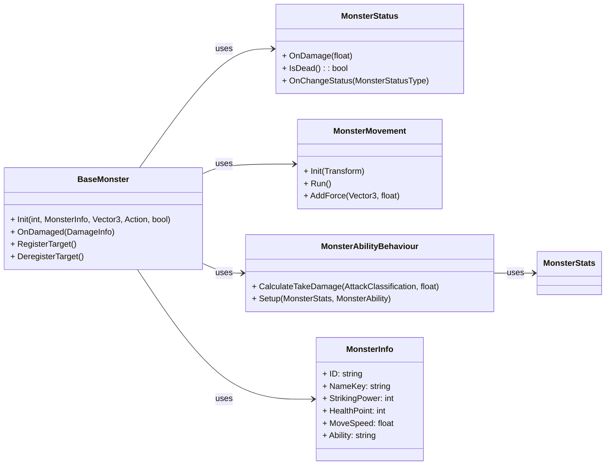
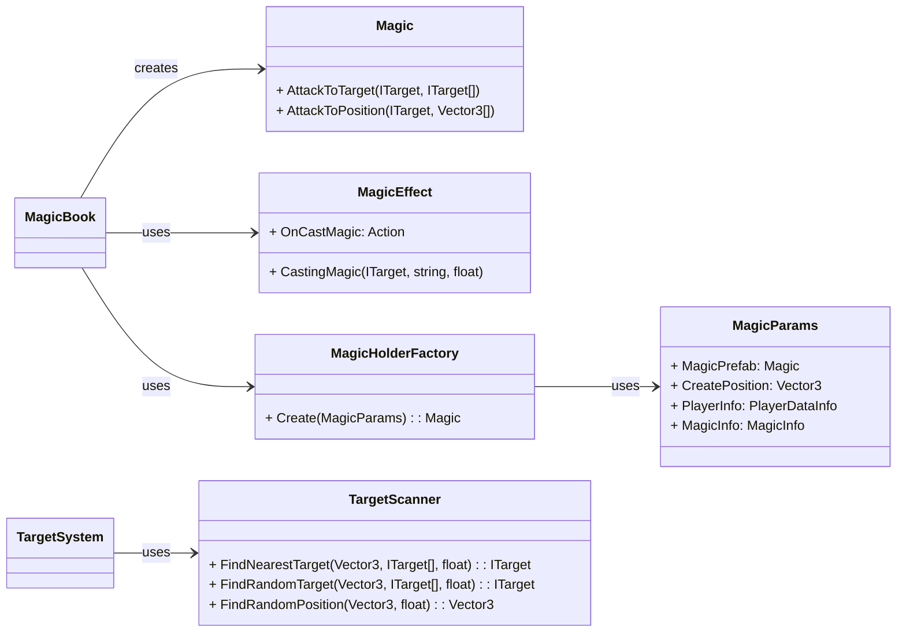

+++
title = "BattleSystem 소개"
description = "SlimeRush 게임의 전투 시스템"
icon = "sword"
date = "2026-01-28T00:00:00+09:00"
lastmod = "2026-01-28T00:00:00+09:00"
draft = false
toc = true
weight = 201
+++

## 1. 기능 개요
- **BattleSystem**은 SlimeRush 게임의 핵심 전투 관리 시스템으로, 플레이어와 몬스터 간의 전투 로직을 중앙에서 관리하는 통합 시스템입니다. 이 시스템은 데미지 계산, 타겟팅, 마법 시스템, 몬스터 행동 등을 포괄적으로 처리하며, 실시간 전투 상황을 정확하게 구현합니다.
- **제작기간**: 2024.09 ~ 2024.11
- **담당범위**
  - 플레이어
    - 마법 생성 및 관리(`MagicBookLibrary`, `MagicBookParameters`, `MagicBookCreator`)
    - 마법 발동(`MagicBook`)
    - 마법 부가효과(`MagicAbilityInfo`, `MagicAbilityType`)
  - 몬스터
    - 공격 능력 관리(`CommonMonsterCombat`, `MonsterCombatBehaviour`)
    - 공격 능력 핸들링(`MonsterAbilityHandler`)
  - 공통
    - 데미지 시스템(`CommonBattleManager`, `IDamageAble`, `DamageInfo`, `DamageResult`) 
    - 타겟 시스템(`ITarget`, `TargetingOption`, `TargetScanner`, `TargetSystem`)

### 개발 배경 및 요구사항
- **표준 전투 로직 제공**: 정확한 대미지 계산과 다양한 전투 상황에 대응할 수 있는 로직 구현
- **유연한 마법 시스템**: 다양한 마법 타입과 시전 방식을 지원하는 확장 가능한 마법 시스템 구축
- **실시간 전투 처리**: 플레이어와 몬스터 간의 실시간 전투 상호작용 및 상태 관리
- **효율적인 타겟팅 시스템**: 다양한 타겟팅 옵션과 정확한 타겟 추적 기능 제공
- **몬스터 전투 행동 연동**: 몬스터의 지능적인 전투 행동과 플레이어와의 원활한 상호작용 구현
- **성능 최적화**: 대규모 전투 상황에서도 안정적인 성능을 유지할 수 있는 시스템 설계
- **확장성과 유지보수성**: 새로운 전투 요소 추가와 코드 유지보수를 용이하게 하는 아키텍처 구현

### 주요 기능

| 기능 | 설명 |
|-----|-----|
| **마법 생성 및 관리** | 마법책 라이브러리 기반의 마법 할당, 업데이트, 생성 관리 |
| **마법 발동 시스템** | 실시간 쿨타임 관리, 타겟팅 옵션 적용, 마법 시전 처리 |
| **몬스터 공격 능력 관리** | 몬스터 공격 능력 관리, 거리 기반 전투 행동 결정 |
| **몬스터 공격 능력 핸들링** | 개별 공격 능력 처리, 쿨타임 관리, 거리 감지 |
| **대미지 계산 시스템** | 통상 대미지 공식 구현, 크리티컬 히트, 룬 시스템 연동 |
| **대미지 정보/결과 관리** | 대미지 데이터 구조화, 속성 변환, 최종 적용 결과 제공 |
| **타겟 정의 및 서칭** | 타겟 인터페이스 표준화, 다양한 타겟팅 옵션 지원 |
| **실시간 타겟 추적** | 플레이어와 적 사이의 거리 실시간 감시 및 추적 |
 

## 2. 사용된 기술 요소
### 핵심 기술 요소 및 API 활용

| 요소 | 설명 |
|-----|-----|
| **C#** | 전체 핵심 로직 및 유니티 컴포넌트 구현 |
| **Unity Physics** | 레이캐스트, 거리 계산, 물리 연산 |
| **Zenject** | 객체 간 의존성 주입을 자동화하여 높은 응집도와 낮은 결합도 구현 |
| **Unity Coroutines** | 실시간 쿨타임 관리 및 타겟 추적 코루틴 기반 처리 |
| **Unity Events** | 마법 시전, 대미지 적용, 타겟 변경 이벤트 시스템 |
 

### 설계 활용 패턴

| 요소 | 설명 |
|-----|-----|
| **Component-Based Architecture** | 유니티 컴포넌트 기반 설계로 전투 시스템 모듈화 및 재사용성 극대화
| **Strategy Pattern** | 다양한 타겟팅 타입(마우스, 근처, 랜덤 등)을 유연하게 확장 가능 |
| **Factory Pattern** | 마법책 생성을 위한 전문화된 팩토리 클래스 구현 |
| **Observer Pattern** | 데미지 이벤트, 전투 상태 변경 시 관련 모듈에 실시간 알림 |
| **Dependency Injection** | 의존성 주입을 통한 테스트 용이성 및 유연한 아키텍처 구현 |
 

## 3. 전체 시스템 구조도(간략)

  

## 4. 주요 클래스별 역할 및 관계
### 핵심 전투 관리

| 클래스 | 역할 |
|-----|-----|
| **[CommonBattleManager](/docs/projects/rfice/SlimeRush/BattleSystem/CommonBattleManager)** | 전투의 핵심 계산 로직 담당, 데미지 계산, 크리티컬 판정, 쿨타임 계산 |
| **[TargetSystem](/docs/projects/rfice/SlimeRush/BattleSystem/TargetSystem)** | 타겟 관리 및 타겟팅 로직 구현, 플레이어와 적 타겟 추적 | 
| **[MagicBook](/docs/projects/rfice/SlimeRush/BattleSystem/MagicBook)** | 플레이어 마법 시스템 관리, 쿨타임 관리, 마법 시전 및 타겟팅 |
| **[MagicBookLibrary](/docs/projects/rfice/SlimeRush/BattleSystem/MagicBookLibrary)** | 활성화된 마법 관리, 마법책 생성 및 관리, 마법 사용 기록 저장 |
| **[MagicBookCreator](/docs/projects/rfice/SlimeRush/BattleSystem/MagicBookCreator)** | 마법책 생성 팩토리, 의존성 주입을 통한 마법책 인스턴스 생성 |
| **[MagicBookParameters](/docs/projects/rfice/SlimeRush/BattleSystem/MagicBookParameters)** | 마법책 생성에 필요한 매개변수 캡슐화 구조체 |
 

  

### 데미지 및 전투 결과 처리

| 클래스 | 역할 |
|-----|-----|
| **[DamageInfo](/docs/projects/rfice/SlimeRush/BattleSystem/DamageInfo)** | 데미지 정보를 담는 데이터 구조체, 기본 데미지, 크리티컬, 마법 능력 포함 |
| **[DamageResult](/docs/projects/rfice/SlimeRush/BattleSystem/DamageResult)** | 데미지 적용 결과를 담는 구조체, 사망 여부, 적용 데미지, 크리티컬 여부 포함 |
| **[MagicAbilityInfo](/docs/projects/rfice/SlimeRush/BattleSystem/MagicAbilityInfo)** | 마법의 특수 능력을 관리하는 구조체, 점화, 동결, 풍화, 정전기 등 |
| **[ITarget](/docs/projects/rfice/SlimeRush/BattleSystem/ITarget)** | 타겟 인터페이스, 위치, 변환, 데미지 가능 여부 제공 |
| **[IDamageAble](/docs/projects/rfice/SlimeRush/BattleSystem/IDamageAble)** | 데미지 처리 인터페이스, 데미지 적용 및 결과 반환 |
 

  

### 몬스터 전투 시스템

| 클래스 | 역할 | 작업 구분 |
|-----|-----|-----|
| **[BaseMonster](/docs/projects/rfice/SlimeRush/BattleSystem/BaseMonster)** | 몬스터의 기본 전투 기능 구현, 데미지 처리, 상태 관리, 타겟 등록 | **타인 작업** |
| **[MonsterStatus](/docs/projects/rfice/SlimeRush/BattleSystem/MonsterStatus)** | 몬스터 체력, 공격력, 이동 속도 등 상태 정보 관리 | **내 작업** |
| **[MonsterMovement](/docs/projects/rfice/SlimeRush/BattleSystem/MonsterMovement)** | 몬스터 이동 로직 및 물리 연동 처리 | **내 작업** |
| **[MonsterAbilityBehaviour](/docs/projects/rfice/SlimeRush/BattleSystem/MonsterAbilityBehaviour)** | 몬스터 특수 능력 및 회피 로직 처리 | **내 작업** |
| **[CommonMonsterCombat](/docs/projects/rfice/SlimeRush/BattleSystem/CommonMonsterCombat)** | 일반 몬스터 전투 행동 관리, 공격 능력 설정 및 쿨타임 관리 | **내 작업** |
| **[MonsterCombatBehaviour](/docs/projects/rfice/SlimeRush/BattleSystem/MonsterCombatBehaviour)** | 몬스터 전투 행동 기본 클래스, 게임 상태 변경에 따른 전투 행동 제어 | **내 작업** |
 

  

### 마법 시스템 확장

| 클래스 | 역할 | 작업 구분 |
|-----|-----|-----|
| **[Magic](/docs/projects/rfice/SlimeRush/BattleSystem/Magic)** | 마법 객체의 기본 동작 및 시전 로직 | **타인 작업** |
| **[MagicEffect](/docs/projects/rfice/SlimeRush/BattleSystem/MagicEffect)** | 마법 시전 시각 효과 및 사운드 관리 | **타인 작업** |
| **[MagicHolderFactory](/docs/projects/rfice/SlimeRush/BattleSystem/MagicHolderFactory)** | 마법 객체 생성 및 관리를 위한 팩토리 | **타인 작업** |
| **[TargetScanner](/docs/projects/rfice/SlimeRush/BattleSystem/TargetScanner)** | 타겟 탐색 및 위치 찾기 로직 구현 | **내 작업** |
 

  

## 5. 주요 특징
### 기능의 특징
- **정교한 데미지 계산**: 플레이어 공격력, 마법 속성, 크기, 룬 능력 등 다양한 요소를 고려한 복합 데미지 계산
- **유연한 타겟팅 시스템**: 마우스 위치, 가장 가까운 적, 랜덤 타겟 등 5가지 타겟팅 옵션 지원
- **실시간 마법 쿨타임 관리**: 코루틴을 활용한 정확한 쿨타임 계산 및 관리
- **몬스터 AI 연동**: 몬스터 이동, 공격, 사망 등 전투 행동을 체계적으로 관리
- **상태 이상 시스템**: 점화, 동결, 풍화, 정전기 등 마법 속성에 따른 특수 효과 지원
- **물리 연동 타격감**: 물리적 힘 적용을 통한 타격감 있는 전투 구현
- **확장 가능한 아키텍처**: 전략 패턴과 의존성 주입을 통한 용이한 기능 확장
- **성능 최적화**: 오브젝트 풀링을 통한 반복 사용 객체의 메모리 효율화

## 6. UseCase
### 플레이어 마법 시전 시나리오
1. **마법 준비**: 플레이어가 마법북을 선택하고 마법 정보를 로드
2. **타겟 탐색**: 타겟 시스템이 설정된 타겟팅 옵션에 따라 타겟을 탐색
3. **쿨타임 체크**: 마법 쿨타임이 경과했는지 확인
4. **마법 시전**: 마법 객체를 생성하고 시전 효과를 재생
5. **데미지 계산**: CommonBattleManager가 데미지 정보를 생성하고 계산
6. **타겟 공격**: 마법이 타겟에게 도달하고 데미지 적용
7. **결과 처리**: 몬스터가 데미지를 받고 사망 여부 판단, 아이템 드롭

### 몬스터 전투 시나리오
1. **몬스터 소환**: 몬스터가 지정된 위치에 소환되고 타겟 시스템에 등록
2. **플레이어 인식**: 몬스터가 플레이어를 인식하고 추적 시작
3. **데미지 처리**: 플레이어의 공격을 받아 데미지 계산 및 적용
4. **상태 반영**: 데미지에 따라 체력 감소, 애니메이션 트리거, 시각 효과 발생
5. **사망 처리**: 체력이 0이하가 되면 사망 효과 재생 및 아이템 드롭
6. **타겟 해제**: 몬스터가 사망하면 타겟 시스템에서 제거

### 주요 사용처
- 플레이어의 다양한 마법 시전 및 전투 경험 제공
- 몬스터 AI와의 전략적 전투 구현
- 룬 시스템과 연동된 전투 능력 강화
- 실시간 전투 상황에 대한 시각적 및 청각적 피드백
- 전투 밸런스 조정을 위한 정교한 데미지 계산 시스템
- 다양한 전투 상황에 대응할 수 있는 유연한 시스템 구조