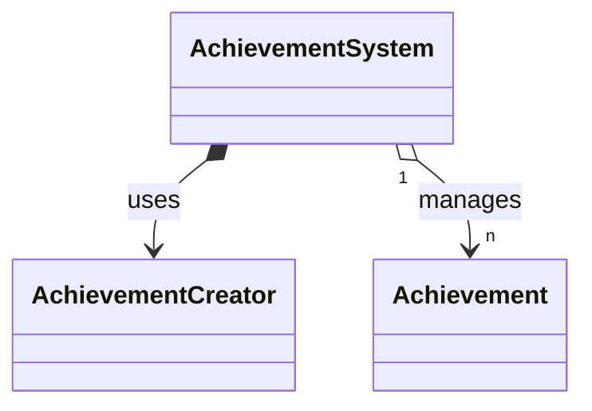
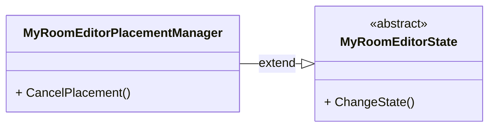
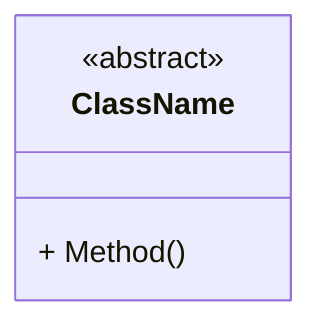
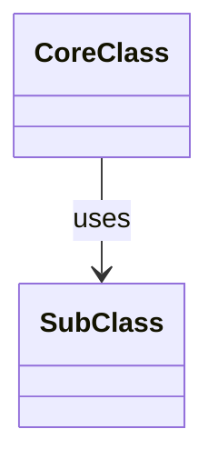
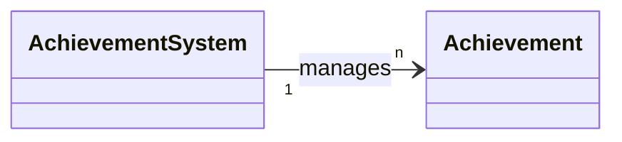

# 포트폴리오 Overview 문서 작성 규칙

AI를 통해 Unity 프로젝트의 시스템 단위 Overview 문서를 자동으로 정리할 때 사용하는 규칙입니다.

---

## 0. 핵심 원칙: 코드 주석 → 클래스 문서 → Overview

**계층적 문서화 워크플로우를 따릅니다.**

1. **1단계: C# 코드 주석화** (`.cs` 파일)
   - 모든 멤버에 XML 문서화 주석(`///`) 추가
   - [포트폴리오 작성규칙.md] 참조

2. **2단계: 클래스 단위 문서 작성**
   - 주석이 완벽한 C# 코드에서 내용 추출
   - [포트폴리오 작성규칙.md]의 템플릿 사용

3. **3단계: Overview 문서 작성** (본 규칙)
   - 클래스 문서들을 종합하여 시스템 전체 관점 작성
   - 아키텍처와 흐름 중심의 고수준 문서

---

## 1. Front Matter (메타데이터)

모든 Overview 문서는 TOML 형식의 Front Matter로 시작해야 합니다:

```toml
+++
title = "시스템명 소개"
description = "간단한 한 줄 설명"
icon = "icon_name"
date = "2023-05-22T00:27:57+01:00"
lastmod = "2023-05-22T00:27:57+01:00"
draft = false
toc = true
weight = 201
+++
```

### 필수 필드

| 필드 | 설명 | 규칙 |
|------|------|------|
| `title` | 시스템명 + "소개" | 예: "BattleSystem 소개", "MyRoomEditor 시스템 소개" |
| `description` | 한 줄 설명 | 50자 이내, '~하는 시스템' 형태 |
| `icon` | 아이콘 코드 | 프로젝트 특성에 맞는 [Google Material Icons](https://fonts.google.com/icons) 사용 |
| `date` | 생성일 | ISO 8601 형식 |
| `lastmod` | 수정일 | ISO 8601 형식 |
| `draft` | 임시 저장 여부 | `false` |
| `toc` | 목차 표시 | `true` |
| `weight` | 정렬 순서 | 프로젝트/시스템별 구간 할당 |

### Weight 구간 할당

| 프로젝트/시스템 | Weight 범위 | 예시 |
|----------------|-------------|------|
| SlimeRush/AchievementSystem | 200 ~ 299 | 201 |
| SlimeRush/BattleSystem | 200 ~ 299 | 201 |
| Rfice/HousingSystem | 400 ~ 499 | 401 |
| Rfist/HeroNetworkSystem | 500 ~ 599 | 501 |
| 기타 시스템 | 600 이상 | - |

### Icon 추천

| 시스템 유형 | 추천 아이콘 |
|------------|------------|
| 전투/배틀 | `swords` |
| 업적/보상 | `military_tech` |
| 하우징/공간 | `home_and_garden` |
| 네트워크 | `lan` |
| 인벤토리/아이템 | `inventory_2` |
| UI/UX | `dashboard` |
| 퀘스트/미션 | `task` |
| 설정/옵션 | `settings` |

---

## 2. 본문 섹션 구조

모든 Overview 문서는 다음 **6개 필수 섹션**을 포함해야 합니다:

```markdown
## 1. 기능 개요
## 2. 사용된 기술 요소
## 3. 전체 시스템 구조도(간략)
## 4. 주요 클래스별 역할 및 관계
## 5. 주요 특징
## 6. UseCase
```

### 2.1 기능 개요

시스템의 전반적인 소개와 개발 정보를 제공합니다.

#### 필수 하위 항목

**시스템 소개**
- 시스템의 정의와 핵심 기능을 2~3문장으로 설명
- 어떤 문제를 해결하는지, 어떤 가치를 제공하는지 명시

```markdown
## 1. 기능 개요
- **BattleSystem**은 SlimeRush 게임의 핵심 전투 관리 시스템으로, 플레이어와 몬스터 간의 전투 로직을 중앙에서 관리하는 통합 시스템입니다...
- **제작기간**: 2024.09 ~ 2024.11
- **시스템 개발 인원**: X인 (역할1 N인, 역할2 N인...)
```

**개발 배경 및 요구사항**
- 왜 이 시스템이 필요했는지
- 해결해야 할 문제들을 불릿 포인트로 나열
- 기술적/비즈니스적 요구사항

```markdown
### 개발 배경 및 요구사항
- 플레이어의 표준 전투 및 데미지를 정의할 수 있는 로직 구현
- 다양한 마법 타입과 시전 방식을 지원하는 확장 가능한 마법 시스템 구축
- 대규모 전투 상황에서도 안정적인 성능을 유지할 수 있는 시스템 설계
```

**주요 기능 (테이블)**
- 구현 주체 표시: `🐨: 직접구현`, `🧑‍💻: 클라이언트 팀원 제작`, `🤝: 협업`
- 각 기능에 연결된 클래스 링크 제공

```markdown
### 주요 기능



| 기능 | 설명 |
|-----|-----|
|**🐨 3D 공간 배치**| UI조작 및 마우스 좌측 클릭을 통해 가구를 원하는 위치에 배치 및 편집 기능. |
|**🐨 마법 생성 및 관리**| 마법책 라이브러리 기반의 마법 생성, 업데이트, 관리 |
|🧑‍💻 데이터 저장| 유저 커스터마이징 결과를 서버에 저장하고 로드. |

```

**데이터 흐름/처리 데모 (선택)**
- GIF, MP4, 이미지 등을 활용한 시각적 설명

```markdown
### 커스터마이징 데모 영상

```

---

### 2.2 사용된 기술 요소

시스템 구현에 사용된 기술 스택과 설계 패턴을 정리합니다.

#### 핵심 기술 요소 및 API 활용 (테이블)

```markdown
## 2. 사용된 기술 요소



### 핵심 기술 요소 및 API 활용

| 요소 | 설명 |
|-----|-----|
|**C#**| 전체 핵심 로직 및 유니티 컴포넌트 구현. |
|[**Input System**](https://docs.unity3d.com/Packages/com.unity.inputsystem@1.18/manual/index.html)|Action 기반 입력 통합 및 디바이스 독립적 처리.|
|[**Zenject**](https://github.com/modesttree/Zenject)|객체 간 의존성 주입을 자동화하여 높은 응집도와 낮은 결합도의 코드베이스 구축.|

```

#### 설계 활용 패턴 (테이블)

```markdown
### 설계 활용 패턴

| 요소 | 설명 |
|-----|-----|
|**🤝 Clean Architecture**| Presentation, Domain, Data 계층을 명확히 분리하여 비지니스 로직과 서버 로직을 완벽하게 분리.|
|**MVP (Model-View-Presenter)**|편집 UI(View)와 편집 로직(Presenter)의 책임을 분리하여 UI변경에 유연하게 대응.|
|**전략 패턴 (Strategy Pattern)**|오브젝트 배치/선택/편집 등 다양한 편집 모드별 처리 로직을 분리.|
|**옵저버 패턴 (Observer Pattern)**|오브젝트 상태 및 사용자 조작에 따른 변화를 관련 모듈에 실시간으로 전달.|

```

---

### 2.3 전체 시스템 구조도(간략)

시스템의 전체적인 클래스 관계를 Mermaid 클래스 다이어그램으로 표현합니다.

```markdown
## 3. 전체 시스템 구조도(간략)


```

#### 다이어그램 작성 규칙

1. **direction**: 시스템 복잡도에 따라 선택
   - `TD` (Top-Down): 계층적 구조
   - `LR` (Left-Right): 수평적 흐름
   - `DT` (Down-Top): 하위 → 상위 관계

2. **클릭스 표현**:
   - `<<abstract>>`: 추상 클래스
   - `<<interface>>`: 인터페이스
   - `<<struct>>`: 구조체
   - `<<enum>>`: 열거형

3. **관계 표현**:
   - `--|>`: 상속/구현 (inheritance)
   - `o-->`: 연관 (association/uses)
   - `*-->`: 컴포지션 (composition)
   - `-->`: 의존 (dependency)

4. **작업 범위 표시**:
   - `` 추가
   - 전체 클래스가 아닌 자신이 작업한 범위만 표시

---

### 2.4 주요 클래스별 역할 및 관계

기능별로 클래스를 그룹화하여 상세히 설명합니다.

```markdown
## 4. 주요 클래스별 역할 및 관계



### 상태관리 클래스

| 클래스 | 역할 |
|-----|-----|
|[**MyRoomEditorState**](/docs/projects/rfice/housingsystem/myroomeditorstate/)<br> *<<abstract>>*| ️💡 MyRoomEditor의 상태를 관리하는 abstract 클래스.<br> 💡 `InputDispatcher`와 상태 핸들을 통해 입력 이벤트를 처리. |
|[**MyRoomEditorPlacementManager**](/docs/projects/rfice/housingsystem/myroomeditorplacementmanager/)<br>: MyRoomEditorState| ️💡 오브젝트 생성 및 배치 상태를 관리하는 implement 클래스. |

```

#### 작성 규칙

1. **기능별 그룹화**:
   - 상태 관리
   - 입력 처리
   - 오브젝트 관리
   - UI 컴포넌트
   - 데이터 모델
   - 등...

2. **클릭스 링크**:
   - `[**ClassName**](/docs/projects/ProjectName/SystemName/classname/)` 형식
   - URL은 소문자로 변환
   - 상속/구현 관계는 클래스명 아래에 `: ParentClass` 형식으로 표시

3. **역할 설명**:
   - `💡` (전구 이모지)로 핵심 책임 표시
   - `백틱`으로 클래스명, 메서드명, 타입명 강조
   - 2~3개의 불릿 포인트로 핵심 기능 요약

4. **상세 다이어그램**:
   - 각 그룹 뒤에 해당 그룹의 클래스 관계를 Mermaid 다이어그램으로 추가
   - 너무 복잡하면 생략 가능

```markdown

```

---

### 2.5 주요 특징

시스템의 기술적/기능적 특징을 정리합니다.

```markdown
## 5. 주요 특징

### 기능의 특징
- **실시간 배치 검증**: 코루틴 기반 실시간 충돌 감지 및 배치 가능성 검증
- **모듈식 아키텍처**: 각 기능별 독립적 모듈로 구성하여 확장성 및 유지보수성 향상
- **상태 관리**: 작업 이력을 통한 실행 취소/다시 실행 기능
- **플렛폼 확장성 고려**: 모바일 환경 확장성을 고려한 입력 및 편집 환경 구성
```

#### 작성 규칙

- **굵은 제목**: `**특징명**` 형식으로 핵심 특징 강조
- **콜론 뒤 설명**: 특징에 대한 구체적 설명
- 4~6개 항목으로 핵심 강점 정리

---

### 2.6 UseCase

시스템의 실제 사용 시나리오를 설명합니다.

```markdown
## 6. UseCase

### 업적 달성 시나리오
1. **업적 초기화**: 게임 시작 시 업적 시스템 초기화 및 데이터 로드
2. **업적 활성화**: 선행 조건 만족 시 업적 자동 활성화
3. **조건 달성**: 게임 진행 중 조건 달성 시 진행 상황 업데이트
4. **업적 완료**: 모든 조건 달성 시 업적 완료 처리 및 기능 해금

### 주요 사용처
- 게임 내 성취도 시스템
- 플레이어 동기 부여 및 해금 시스템
- 게임 진행 상황 추적 및 분석
```

#### 작성 규칙

**시나리오**:
- `### 시나리오명` 형식의 하위 섹션
- 번호 + **굵은 동사**: `1. **초기화**:`
- 화살표로 흐름 표현: `→`

**사용처**:
- 불릿 포인트로 나열
- 실제 적용 가능한 분야 기술

---

## 3. 작성 규칙

### 3.1 테이블 작성

```markdown

| 헤더1 | 헤더2 |
|-------|-------|
| 내용1 | 내용2 |

```

- `table-striped` 클래스 필수
- 헤더 구분선 `|-----|-----|` 사용
- 클래스명은 볼드 `**ClassName**`
- 코드/타입은 백틱 `` `Type` ``

### 3.2 알림(Alert) 작성

```markdown

```

- `context`: `info`, `warning`, `success`, `danger` 중 선택
- 구현 주체 표시, 범위 표시 등에 사용

### 3.3 날춁 링크 작성

```markdown
[표시텍스트](/docs/projects/프로젝트명/시스템명/클릭스소문자/)
```

- URL은 모두 소문자로 변환
- 파일 확장자 `.md` 제외
- 클래스명은 원래 대소문자 유지

### 3.4 동영상/이미지 삽입

```markdown



```

- 동영상: `assets/videos/` 기준 경로
- 이미지: `assets/images/` 기준 경로

### 3.5 Mermaid 다이어그램

```markdown

```

- 백틱 3개 + `mermaid` 언어 태그
- `direction`: `TD`, `LR`, `DT`, `RL` 중 선택
- 스테레오타입: `<<abstract>>`, `<<interface>>`, `<<struct>>`, `<<enum>>`

---

## 4. 템플릿

### 4.1 Overview 문서 전체 템플릿

```markdown
+++
title = "시스템명 소개"
description = "시스템의 간단한 설명"
icon = "icon_name"
date = "2023-05-22T00:27:57+01:00"
lastmod = "2023-05-22T00:27:57+01:00"
draft = false
toc = true
weight = 201
+++

## 1. 기능 개요

- **시스템명**은 프로젝트명의 핵심 시스템으로, ...
- **개발 기간**: 2024.XX ~ 2024.XX
- **시스템 개발 인원**: X인 (역할1 N인, 역할2 N인...)

### 개발 배경 및 요구사항
- 요구사항 1
- 요구사항 2
- 요구사항 3

### 주요 기능




| 기능 | 설명 |
|-----|-----|
|**🐨 기능명1**| 기능1 설명. |
|**🐨 기능명2**| 기능2 설명. |
|🧑‍💻 기능명3| 기능3 설명. |


## 2. 사용된 기술 요소



### 핵심 기술 요소 및 API 활용

| 요소 | 설명 |
|-----|-----|
|**C#**| 전체 핵심 로직 및 유니티 컴포넌트 구현. |
|[**기술명**](https://docs.unity3d.com/...)|기술 설명.|


### 설계 활용 패턴

| 요소 | 설명 |
|-----|-----|
|**패턴명**| 패턴 설명 및 적용 이유.|


## 3. 전체 시스템 구조도(간략)



## 4. 주요 클래스별 역할 및 관계



### 기능 그룹명 (예: 상태관리 클래스)

| 클래스 | 역할 |
|-----|-----|
|[**ClassName**](/docs/projects/project/system/classname/)<br> *<<abstract>>*| 💡 역할 설명.<br> 💡 추가 설명. |


## 5. 주요 특징

### 기능의 특징
- **특징명**: 특징 설명
- **특징명**: 특징 설명

## 6. UseCase

### 시나리오명
1. **단계1**: 설명
2. **단계2**: 설명

### 주요 사용처
- 사용처 1
- 사용처 2
```

---

## 5. 체크리스트

Overview 문서 작성 완료 후 다음 항목을 확인하세요:

### Front Matter 확인
- [ ] `title`이 "시스템명 소개" 형식인가?
- [ ] `description`이 50자 이내인가?
- [ ] `icon`이 적절한 Material Icon인가?
- [ ] `weight`이 올바른 구간에 있는가?

### 섹션 구조 확인
- [ ] `## 1. 기능 개요` 섹션이 존재하는가?
- [ ] 개발 기간과 인원이 명시되어 있는가?
- [ ] 개발 배경 및 요구사항이 3개 이상인가?
- [ ] 주요 기능 테이블에 구현 주체 표시(🐨/🧑‍💻)가 있는가?
- [ ] `## 2. 사용된 기술 요소` 섹션이 존재하는가?
- [ ] 기술 요소와 설계 패턴 테이블이 각각 존재하는가?
- [ ] `## 3. 전체 시스템 구조도(간략)` 섹션이 존재하는가?
- [ ] Mermaid 클래스 다이어그램이 유효한가?
- [ ] `## 4. 주요 클래스별 역할 및 관계` 섹션이 존재하는가?
- [ ] 클래스가 기능별로 그룹화되어 있는가?
- [ ] 각 클래스에 날춁 링크가 있는가?
- [ ] `## 5. 주요 특징` 섹션이 존재하는가?
- [ ] 4~6개의 핵심 특징이 있는가?
- [ ] `## 6. UseCase` 섹션이 존재하는가?
- [ ] 시나리오가 단계별로 설명되어 있는가?

### 링크 및 코드 확인
- [ ] 모든 날춁 링크가 소문자 URL을 사용하는가?
- [ ] 테이블에 `table-striped` 클래스가 있는가?
- [ ] 필요한 곳에 ``가 사용되었는가?
- [ ] 다이어그램 방향이 적절하게 설정되었는가?

### 내용 확인
- [ ] 모든 설명이 한국어로 작성되었는가?
- [ ] 직접 구현한 요소와 팀원 구현 요소가 명확히 구분되는가?
- [ ] 역할 설명에 💡 이모지가 사용되었는가?
- [ ] 전문 용어에 적절한 설명이 추가되었는가?

---

## 6. 작성 예시 (완성된 예시)

아래는 AchievementSystem Overview의 축약된 예시입니다:

```markdown
+++
title = "AchievementSystem 소개"
description = "SlimeRush 게임의 업적 시스템"
icon = "military_tech"
date = "2026-01-16T00:00:00+09:00"
lastmod = "2026-01-16T00:00:00+09:00"
draft = false
toc = true
weight = 201
+++

## 1. 기능 개요
- **AchievementSystem**은 SlimeRush 게임의 **업적 시스템**으로, 플레이어의 게임 **진행 상황을 추적하고 업적 달성 시 새로운 능력을 해금**하는 통합 시스템입니다.
- **제작기간**: 2024.09 ~ 2024.11
- **시스템 개발 인원**: 2인 (👨‍💻 유니티 클라이언트 1인,👩‍🎨 UI 디자인 1인)

### 개발 배경 및 요구사항
- 플레이어의 게임 **진행 상황을 추적하고 성취도를 시각적으로 표시**
- 업적 달성을 통해 **게임 요소 해금**
- 다양한 업적 조건 타입 지원

### 주요 기능

| 기능 | 설명 |
|-----|-----|
| **업적 생성 및 관리** | 시트 데이터와 저장 데이터를 결합하여 업적 객체 생성 및 관리 |
| **상태 관리** | 업적의 비활성, 활성, 완료 상태 관리 및 전환 |


## 2. 사용된 기술 요소
### 핵심 기술 요소 및 API 활용

| 요소 | 설명 |
|-----|-----|
| **C#** | 전체 핵심 로직 및 유니티 컴포넌트 구현 |
| [**Unity Localization**](...) | 다국어 지원 및 로컬라이제이션 관리 |


### 설계 활용 패턴

| 요소 | 설명 |
|-----|-----|
| **Clean Architecture** | Presentation, Domain, Data 계층을 명확히 분리 |
| **Repository Pattern** | 데이터 접근 추상화를 통한 유연한 데이터 소스 관리 |


## 3. 전체 시스템 구조도(간략)


## 4. 주요 클래스별 역할 및 관계
### 업적 시스템 관리

| 클래스 | 역할 |
|-----|-----|
|[**AchievementSystem**](/docs/projects/SlimeRush/AchievementSystem/AchievementSystem)| 💡 업적 시스템의 핵심 중앙 관리자, 상태 관리, 진행 상황 추적, 데이터 저장/로드 호출|


## 5. 주요 특징
### 기능의 특징
- **업적 조건 시스템**: 다양한 조건 타입을 지원하고 확장 가능
- **데이터 영속성**: 로컬 및 클라우드 저장소를 통한 데이터 동기화

## 6. UseCase
### 업적 달성 시나리오
1. **업적 초기화**: 게임 시작 시 업적 시스템 초기화 및 데이터 로드
2. **업적 활성화**: 선행 조건 만족 시 업적 자동 활성화

### 주요 사용처
- 게임 내 성취도 시스템
- 플레이어 동기 부여 및 해금 시스템
```
